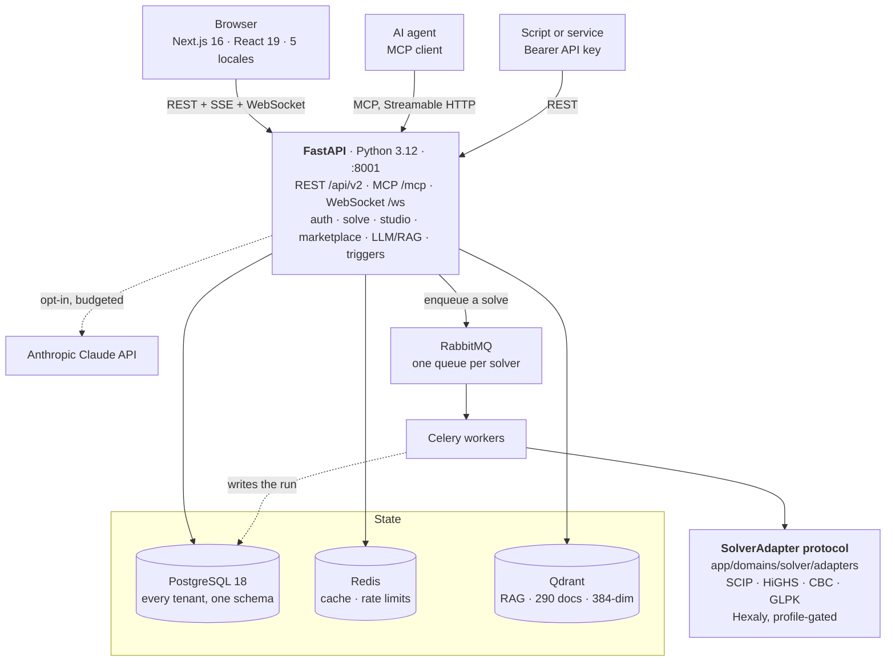

# JAOT — Just Another Optimization Tool

**Software that decides.** How much of each product to make, which orders go on which
van, who covers which shift, what to buy and when — decisions with more combinations
than anyone can weigh by hand, and a real cost to getting wrong. Describe one in plain
language or JSON, and JAOT gives you the best answer, what it is worth, and which limit
is the one holding you back.

[](https://github.com/avallavall/jaot/actions/workflows/ci.yml)
[](https://github.com/avallavall/jaot/releases)
[](LICENSE)
[](pyproject.toml)
[](#built-with)

**Live demo → [jaot.io](https://jaot.io)** — the reference deployment, running the
same images you can build from this repo. Browse the marketplace and the docs
without an account; solving needs one.

[Quickstart](#quickstart) · [Architecture](#architecture) ·
[Development](#development) · [Documentation](#documentation) ·
[License](#license)

---

## What it is

You say what you are deciding, what constrains you — capacity, budget, hours,
stock — and what "best" means for you: cheapest, fastest, most profit. JAOT turns
that into a mathematical model, hands it to an industrial solver, and gives you
back the decision in the same terms you asked the question in.

**You do not need to know what a MIP is to use it.** If you do, nothing is hidden:
the model, the solve log, the gap and the full post-solve analysis are all there,
and an answer that could only be proven within a bound says so instead of posing
as exact.

It is **a platform, not a library and not a hosted service** — you run it yourself
with `docker compose up`. It comes with a web interface, a REST API, and an MCP
server so AI agents can use it too. Four solvers ship with it (SCIP, HiGHS, CBC
and GLPK) and adding another means writing one adapter.

**Free, with no paid tier.** No billing, no credits, no upsell — the marketplace is
people sharing models, not selling them. Fair use is a set of request limits and
solve quotas you configure yourself, and the AI assistant runs on a monthly budget
you set, or on your own API key.

**Nothing caps the size of your models but your hardware.** There is no ceiling on
model size, expression length, thread count or solve time — every limit is a setting
you own, where `0` means unlimited. A model with two million variables solves if your
machine can hold it. A public instance with open registration can set real numbers;
a private one need not.

### Solve

- **Solver-agnostic core** — an `OptimizationProblem` schema that stays
  independent of the solver. Ships SCIP (via PySCIPOpt), HiGHS (via highspy),
  and CBC and GLPK as separate command-line programs; an optional Hexaly adapter
  is bring-your-own-license.
- **Compare solvers on the same problem** — run one model on several solvers
  under identical terms (same time limit, same gap tolerance, one machine, one
  at a time) and read what each of them actually did: result, objective, best
  bound, gap, time, nodes and iterations. A solver that cannot express the model
  says so in its own row instead of leaving a blank. Inside a model's workspace
  the same thing crosses several datasets with several solvers as a matrix, so
  the answer is not decided by one month's data.
- **The interface adapts to your solver** — each adapter declares what it
  supports, so the UI tells you up front what your chosen solver will not give
  you (a metaheuristic computes no shadow prices) instead of offering a panel
  that then comes back empty.
- **Standard formats in and out** — MPS, LP, CIP and JSON, with a preview before
  you commit to a solve.

### Understand

- **Analysis that leads with facts** — don't just solve, *understand*. Solutions
  come back as decisions (grouped by the model's real index structure, not a wall
  of `x_3_7 = 1` rows) with an honest solve summary (root node / N nodes / time
  limit + gap) and an **exact, solution-based analysis**: binding constraints,
  slack and utilization computed from your actual solution — exact for the
  integer optimum on every solver. LP sensitivity (shadow prices, reduced costs)
  stays available with its caveats, and a one-click AI explanation translates the
  result into plain language grounded strictly in your actual numbers.
- **What-if answers measured, not estimated** — ask what one more unit would
  actually buy you and JAOT perturbs the solved model and solves it again: RHS
  ranging on the binding constraints (as a tornado chart) and decision regret
  (what overruling a binary decision costs). Every figure is measured on the real
  MIP rather than read off an LP relaxation, and a scenario that hits its time
  limit is reported as a bound, never as an exact number.
- **Infeasibility diagnosis** — when a model cannot be satisfied, get the minimal
  conflicting set of constraints instead of a bare `INFEASIBLE`.

### Build and share

- **LLM formulation assistant** — turn a natural-language description into a
  runnable model, grounded in a RAG index over the template library (Qdrant +
  local sentence-transformers; no data leaves your box except the Claude calls
  you opt into).
- **Model studio** — one versioned workspace per model: build it on a visual
  canvas, with the AI assistant, in a JSON editor, or in the JModel DSL
  (sets/params — with a mathematical-notation view, draft derivation from flat
  models, and compile-verified AI generation from a description or a screenshot);
  analyze health and stats; solve with live progress; commit versions git-style
  ("what changed + why"), diff and restore them; run the same model against many
  datasets and scenarios.
- **Model marketplace** — a free, collaborative gallery: publish a committed
  version of your model, and bring any community model into your own studio with
  one click ("Use in studio" creates your editable, versioned copy). No prices or
  commissions — authors share; adoption is the metric.
- **102 templates + 33 problem generators** — knapsack, vehicle routing,
  scheduling, production planning, portfolio, a full MDPDP-TW formulation, and
  more.

### Integrate and operate

- **MCP server** — 34 curated tools for AI agents over the Model Context
  Protocol: an agent can author a versioned model, solve it, and ask what is
  saturated, why a model is infeasible, or what one more unit is worth.
- **REST API v2** — every capability of the UI is an endpoint, authenticated with
  a Bearer API key.
- **Multi-tenant auth, an admin panel, i18n (en/es/ca/fr/de), and a
  Prometheus/Grafana/Alertmanager monitoring stack** — included.

---

## Quickstart

### Requirements

- **Git** and **Docker + Docker Compose** (the recommended path — everything runs
  in containers).
- Or, for a local install without Docker: **Python 3.12** and a PostgreSQL
  instance.

### Run it

```bash
git clone https://github.com/avallavall/jaot.git && cd jaot
cp .env.example .env   # includes first-run admin credentials — change the password
docker compose up -d   # migrates, seeds the catalog, creates your admin on first boot
```

This brings up PostgreSQL, RabbitMQ, Redis, Qdrant, the API (port 8001), two
Celery workers (the general one and the solver-comparison one), Celery beat, and
the frontend (port 3000). Both ports bind to `127.0.0.1` only, so nothing is
exposed to your network until you put a reverse proxy in front.

Then check what still needs configuring (SMTP, AI key…):

```bash
docker compose exec api python scripts/doctor.py
```

Open http://localhost:3000 and log in with your `SEED_ADMIN_*` credentials. See
[Configuration](docs/getting-started/configuration.md) for the full guide.

### Solve over HTTP

```bash
docker compose exec api python scripts/ensure_admin_api_key.py   # prints your API key

curl -X POST http://localhost:8001/api/v2/solve \
  -H "Authorization: Bearer <your-api-key>" \
  -H "Content-Type: application/json" \
  -d '{"name":"test","variables":[{"name":"x","type":"continuous","lower_bound":0,"upper_bound":10}],"objective":{"sense":"maximize","expression":"3*x"},"constraints":[{"name":"c1","expression":"x <= 5"}]}'
```

Returns `{"status":"optimal","objective_value":15.0,...}`.

### Connect an AI agent (MCP)

The MCP server speaks Streamable HTTP at `/mcp`. Browsing templates and the
marketplace needs no key; anything that reads or writes your data takes a Bearer
API key:

```bash
claude mcp add --transport http jaot http://localhost:8001/mcp \
  --header "Authorization: Bearer <your-api-key>"
```

Full setup guide (Claude Code, Claude Desktop, opencode, OpenAI Responses API) →
[docs/getting-started/QUICKSTART.md](docs/getting-started/QUICKSTART.md).

---

## Architecture



A **modular monolith**: one process, one database, boundaries enforced in code.
Two bounded contexts are extracted so far — the solver (`app/domains/solver/`,
behind a `SolverAdapter` protocol) and the JModel compiler (`app/domains/dsl/`,
which may import `app.schemas` and nothing else). Seven `import-linter`
contracts fail the build if an import crosses a boundary. Adding a solver means
writing one adapter — see
[docs/ARCHITECTURE/OVERVIEW.md](docs/ARCHITECTURE/OVERVIEW.md).

---

## Development

```bash
pip install -r requirements.txt -r requirements-dev.txt
pip install "ruff==0.16.3" "import-linter>=2.1"   # the versions CI pins

pytest                            # backend tests — real PostgreSQL, no mocked DB
ruff check app/ infra/ scripts/ deploy/ tests/    # backend lint (100-char lines)
ruff format --check app/ infra/ scripts/ deploy/ tests/   # CI runs this too
lint-imports                      # the 7 domain boundary contracts

cd frontend                       # Node 24
npm ci
npm run lint                      # frontend lint
npm run test                      # unit tests (vitest)
npm run build                     # the real frontend gate — see the note below
npm run test:e2e                  # end-to-end (playwright, against a prod-like build)
```

`npm run build` catches errors that `tsc` and `eslint` do not, so run it before
you open a PR. Its `prebuild` step overwrites `frontend/src/lib/generated/api.ts`
from whatever API container is running on port 8001. Start the current API first,
or the generated types go stale under you.

`ruff` and `lint-imports` run twice: as pre-commit hooks
(`.pre-commit-config.yaml`) and as CI steps, because a hook can be skipped with
`--no-verify`. Both places pin the same versions.

Database migrations:

```bash
alembic -c infra/alembic.ini upgrade head
alembic -c infra/alembic.ini revision --autogenerate -m "description"
```

Conventions, dev setup and the PR checklist are in
[CONTRIBUTING.md](CONTRIBUTING.md).

---

## Documentation

| Doc | Description |
|---|---|
| [Quickstart](docs/getting-started/QUICKSTART.md) | From zero to first solve |
| [Configuration](docs/getting-started/configuration.md) | Self-hosting config: `.env` vs admin panel, + the config doctor |
| [Architecture](docs/ARCHITECTURE/OVERVIEW.md) | System design, components, data model |
| [Bounded contexts](docs/BOUNDED_CONTEXTS.md) | The domain map the modular monolith is being extracted along |
| [JModel grammar](docs/JMODEL_GRAMMAR.md) | The sets/params DSL, formally |
| [Testing & Quality](docs/TESTING.md) | Test strategy, coverage, mutation scores |
| [Deployment](docs/operations/DEPLOYMENT.md) | Running JAOT in production |
| [Disaster Recovery](deploy/DISASTER-RECOVERY.md) | Incident response runbook |
| [Roadmap](docs/ROADMAP.md) | Where the project is heading — now / next / later |
| [Changelog](docs/CHANGELOG.md) | What changed, release by release |
| [Contributing](CONTRIBUTING.md) | Dev setup and conventions |
| [Security policy](SECURITY.md) | Reporting a vulnerability |
| [MDPDP Spec](docs/specifications/MDPDP_TW_T_FORMULATION.md) | A worked mathematical formulation |

---

## Built with

JAOT stands on the **[SCIP Optimization Suite](https://www.scipopt.org/)** (Zuse
Institute Berlin) and **[HiGHS](https://highs.dev/)** — full attributions in
[THIRD_PARTY_LICENSES](THIRD_PARTY_LICENSES).

Built solo and AI-accelerated. What you can verify rather than take on faith:
tests run against real PostgreSQL (no mocked DB), domain boundaries are enforced
by import-linter contracts, the frontend's API types are regenerated from the
backend schema on every push and must match what is committed, and every change
is gated by lint, tests, and security scans (`bandit`, `pip-audit`,
`npm audit`). Details, coverage, and
mutation-test scores in [Testing & Quality](docs/TESTING.md).

**Maintained best-effort** — monthly issue triage, quarterly dependency/CVE pass.
Issues and focused PRs welcome; see [CONTRIBUTING.md](CONTRIBUTING.md) and
[SECURITY.md](SECURITY.md).

---

## Citing the solvers

JAOT is powered by **SCIP 10** (via PySCIPOpt) and **HiGHS**, and also ships
**CBC** (EPL-2.0) and **GLPK** (GPL-3.0-or-later) as separate command-line
programs. As the SCIP team [requests](https://www.scipopt.org/index.php#cite),
any work that uses SCIP should acknowledge and cite it. If JAOT helps your
research or product, please cite the underlying solvers:

```bibtex
@misc{scip10,
  title        = {The {SCIP} Optimization Suite 10.0},
  author       = {Christopher Hojny and Mathieu Besançon and Ksenia Bestuzheva and Sander Borst and João Dionísio and Johannes Ehls and Leon Eifler and Mohammed Ghannam and Ambros Gleixner and Adrian Göß and Alexander Hoen and Jacob von Holly-Ponientzietz and Rolf van der Hulst and Dominik Kamp and Thorsten Koch and Kevin Kofler and Jurgen Lentz and Marco Lübbecke and Stephen J. Maher and Paul Matti Meinhold and Gioni Mexi and Til Mohr and Erik Mühmer and Krunal Kishor Patel and Marc E. Pfetsch and Sebastian Pokutta and Chantal Reinartz Groba and Felipe Serrano and Yuji Shinano and Mark Turner and Stefan Vigerske and Matthias Walter and Dieter Weninger and Liding Xu},
  year         = {2025},
  howpublished = {Optimization Online preprint, arXiv:2511.18580},
  url          = {https://arxiv.org/abs/2511.18580}
}

@article{achterberg2009scip,
  title   = {{SCIP}: solving constraint integer programs},
  author  = {Achterberg, Tobias},
  journal = {Mathematical Programming Computation},
  volume  = {1},
  number  = {1},
  pages   = {1--41},
  year    = {2009},
  doi     = {10.1007/s12532-008-0001-1}
}

@article{huangfu2018highs,
  title   = {Parallelizing the dual revised simplex method},
  author  = {Huangfu, Qi and Hall, J. A. Julian},
  journal = {Mathematical Programming Computation},
  volume  = {10},
  number  = {1},
  pages   = {119--142},
  year    = {2018},
  doi     = {10.1007/s12532-017-0130-5}
}
```

---

## License

[Apache License 2.0](LICENSE) — see also [NOTICE](NOTICE). Third-party license
attributions are in [THIRD_PARTY_LICENSES](THIRD_PARTY_LICENSES).
