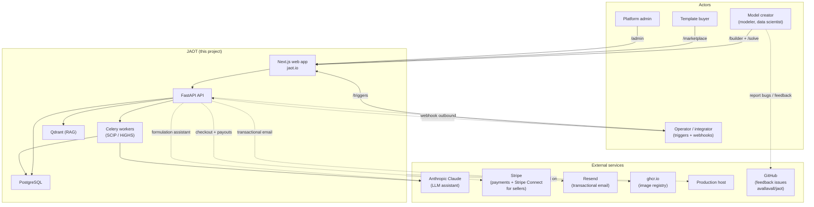

# System Context — C4 Level 1

> Highest-level view: what JAOT is, who uses it, which external systems it talks to. Intended for someone joining the project for the first time.

> **Note (2026-06-25):** The marketplace is **free and collaborative by default** (`MONETIZATION_ENABLED=false`). The Stripe payments, commission split, and seller payouts described below are dormant and only apply to a self-hosted deployment that enables monetization.

## What is JAOT

A SaaS platform to **build, buy, and automate optimization models** (linear programming, mixed-integer, etc.). Users create models in a visual builder, solve them against solvers (SCIP, HiGHS; Hexaly / Gurobi / CPLEX on the roadmap), share/sell them on a marketplace, or run them via schedule / webhook.

## Context diagram

## External channels

| Service | Use | Envelope |
|----------|-----|----------|
| Anthropic Claude | formulation assistant (LLM + RAG) | HTTPS streaming API |
| Stripe + Stripe Connect | credit payments, payouts to marketplace sellers | Checkout + webhooks |
| Resend | transactional email (signup, reset, notifications) | HTTP API |
| GHCR (GitHub Container Registry) | push/pull of Docker images from the CI pipeline | HTTP auth token |
| Production host | server hosting | SSH + Caddy TLS |
| GitHub Issues (`avallavall/jaot`) | public feedback / bug report channel | public repo |

## Inbound flows

1. **HTTP/HTTPS traffic** — `jaot.io` → Caddy → Frontend / API.
2. **Inbound webhooks** — configurable triggers (`POST /api/v2/triggers/{id}/fire`) with `trigger_secret`.
3. **Stripe webhooks** — confirm payments, update `credit_transaction` / `invoice`.
4. **Deploy** — push to `main` → GitHub Actions self-hosted runner rebuilds the stack.

## Outbound flows

1. **Email** — Resend (signup, reset, solve completed, notifications).
2. **LLM calls** — Anthropic API for the formulation assistant (SSE streaming to the frontend).
3. **Outbound webhooks** — post-trigger or post-execution, configurable payload delivery.
4. **Stripe payouts** — Stripe Connect to the seller after a template sale (10% platform commission by default, configurable). Dormant unless monetization is enabled.

## Scope

- **1 active milestone** in `ROADMAP.md` — multi-solver (Phase 6 complete in code).
- **Deploy target:** a single self-hosted Linux server. There is no AWS/GCP plan.
- **Current scale:** early-stage, a single server. Per-solver Celery workers allow scaling components independently if needed.
