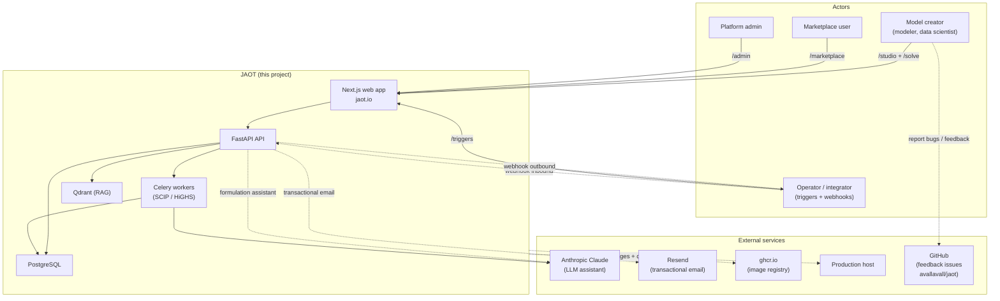

# System Context — C4 Level 1

> Highest-level view: what JAOT is, who uses it, which external systems it talks to. Intended for someone joining the project for the first time.

> **Note (ADR-008, 2026-07-10):** the platform is **free and collaborative** — the money layer
> (Stripe, checkout, payouts, credits) was removed entirely. Fair use is enforced by rate limits,
> solve quotas/caps, and a monthly EUR budget for the AI assistant.

## What is JAOT

A platform to **build, use, and automate optimization models** (linear programming, mixed-integer, etc.). Users create models in a versioned studio (canvas, AI assistant, editor, DSL), solve them against solvers (SCIP, HiGHS, CBC and GLPK ship; Hexaly is profile-gated), share them on a free community marketplace, or run them via schedule / webhook.

## Context diagram

```mermaid
flowchart TB
    subgraph Users["Actors"]
        Creator["Model creator<br/>(modeler, data scientist)"]
        Consumer["Marketplace user"]
        Operator["Operator / integrator<br/>(triggers + webhooks)"]
        Admin["Platform admin"]
    end

    subgraph JAOT["JAOT (this project)"]
        WebApp["Next.js web app<br/>jaot.io"]
        API["FastAPI API"]
        Workers["Celery workers<br/>(SCIP / HiGHS)"]
        DB["PostgreSQL"]
        Qdrant["Qdrant (RAG)"]
    end

    subgraph External["External services"]
        Anthropic["Anthropic Claude<br/>(LLM assistant)"]
        Resend["Resend<br/>(transactional email)"]
        GHCR["ghcr.io<br/>(image registry)"]
        Server["Production host"]
        GitHub["GitHub<br/>(feedback issues<br/>avallavall/jaot)"]
    end

    Creator -->|/studio + /solve| WebApp
    Consumer -->|/marketplace| WebApp
    Operator -->|/triggers| WebApp
    Operator -.webhook inbound.-> API
    Admin -->|/admin| WebApp

    WebApp --> API
    API --> Workers
    API --> DB
    API --> Qdrant

    API -.formulation assistant.-> Anthropic
    API -.transactional email.-> Resend
    API -.webhook outbound.-> Operator

    Workers --> DB
    Workers --> Anthropic

    JAOT -.images + deploy.-> GHCR
    JAOT -.hosted on.-> Server
    Creator -.report bugs / feedback.-> GitHub
```

## External channels

| Service | Use | Envelope |
|----------|-----|----------|
| Anthropic Claude | formulation assistant (LLM + RAG) | HTTPS streaming API |
| Resend | transactional email (signup, reset, notifications) | HTTP API |
| GHCR (GitHub Container Registry) | push/pull of Docker images from the CI pipeline | HTTP auth token |
| Production host | server hosting | SSH + Caddy TLS |
| GitHub Issues (`avallavall/jaot`) | public feedback / bug report channel | public repo |

## Inbound flows

1. **HTTP/HTTPS traffic** — `jaot.io` → Caddy → Frontend / API.
2. **Inbound webhooks** — configurable triggers (`POST /api/v2/triggers/{id}/fire`) with `trigger_secret`.
3. **Deploy** — push to `main` → GitHub Actions self-hosted runner rebuilds the stack.

## Outbound flows

1. **Email** — Resend (signup, reset, solve completed, notifications).
2. **LLM calls** — Anthropic API for the formulation assistant (SSE streaming to the frontend).
3. **Outbound webhooks** — post-trigger or post-execution, configurable payload delivery.

## Scope

- **Active focus:** multi-solver (Phase 6 complete in code).
- **Deploy target:** a single self-hosted Linux server. There is no AWS/GCP plan.
- **Current scale:** early-stage, a single server. Per-solver Celery workers allow scaling components independently if needed.
