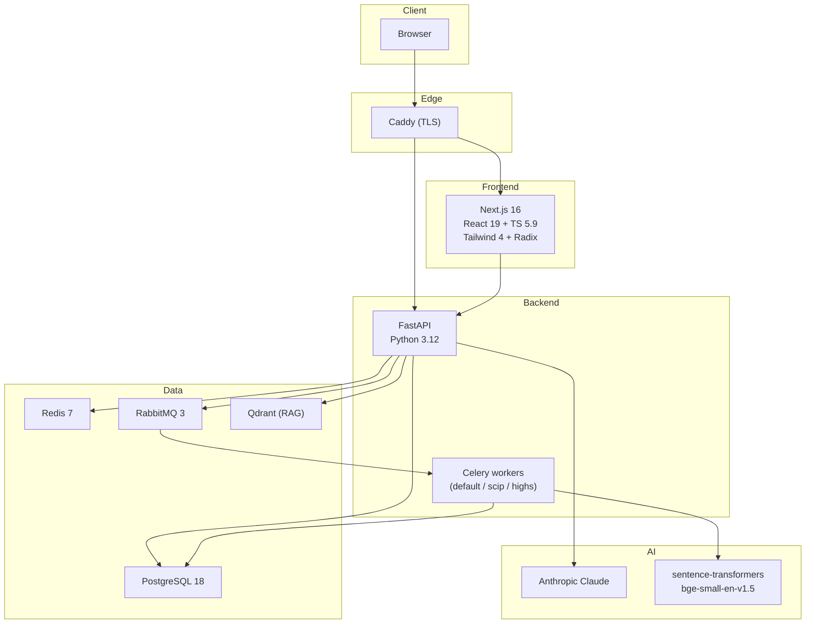

# Tech Stack

> Technologies and versions by layer. Meant to give quick context on what everything is built with.

## Compact table

| Layer | Technology | Version | Role |
|------|------------|---------|-----|
| **Backend** | Python | 3.12 | runtime |
| | FastAPI | — | ASGI web API |
| | SQLAlchemy | 2.0 (Mapped) | ORM |
| | Alembic | — | migrations |
| | Pydantic | v2 | schema validation |
| | Celery | — | async tasks |
| | PySCIPOpt | — | SCIP solver |
| | HiGHS (highspy) | — | HiGHS solver |
| | sentence-transformers | `BAAI/bge-small-en-v1.5` | embeddings for RAG (local CPU, 384 dims) |
| **Runtime infra** | PostgreSQL | 18 | database |
| | Redis | 7 | rate limiting + result backend + pub/sub |
| | RabbitMQ | 3 | Celery broker |
| | Qdrant | — | vector DB (RAG, 186 docs indexed) |
| | Caddy | — | reverse proxy + TLS |
| **Frontend** | Next.js | 16 | framework (App Router) |
| | React | 19 | UI |
| | TypeScript | 5.9 | typing |
| | Tailwind CSS | 4 | styling |
| | Radix UI | — | accessible primitives |
| | next-intl | — | i18n (5 locales: en, es, ca, fr, de) |
| | Zustand | — | local state (builder) |
| | @xyflow/react | — | visual flow editor |
| | Tiptap | — | rich-text editor |
| | recharts | — | charts |
| | lucide-react | — | icons |
| **AI** | Anthropic Claude | — | formulation assistant |
| **Payments** | Stripe + Stripe Connect | — | checkout + seller payouts |
| **Email** | Resend | — | transactional |
| **Deploy** | Docker + Docker Compose | — | container orchestration |
| | GitHub Actions | self-hosted runner | CI + deploy |
| | GitHub Container Registry | — | image registry |
| | Linux server | — | production host |
| **Monitoring** | Prometheus | — | TSDB |
| | Grafana | 12.4 | dashboards |
| | Alertmanager | — | alert routing |
| | celery-exporter | 0.12.2 (sha256-pin) | queue metrics |
| | cAdvisor + node-exporter | — | container + host metrics |
| | blackbox-exporter | — | HTTP + TLS cert checks |
| **Quality** | ruff | — | backend lint + format |
| | bandit | — | static security scan |
| | pip-audit | — | dependency CVE scan |
| | import-linter | — | 6 boundary contracts |
| | pytest | — | backend tests |
| | vitest | — | frontend unit tests |
| | Playwright | — | frontend E2E |

## Logical diagram

## Key rules (from `CLAUDE.md`)

- **IDs:** always prefixed (`generate_id("org_")`), never raw UUIDs.
- **Datetime:** `utcnow()` from `app.shared.utils.datetime_helpers`, never `datetime.now()`.
- **Multi-tenancy:** every org-scoped query MUST filter by `organization_id`.
- **ORM:** idiomatic SQLAlchemy 2.0 — `Mapped[str]`, `mapped_column()`, not `Column()`.
- **Middleware:** pure ASGI, never `BaseHTTPMiddleware`.
- **CORS:** explicit, never wildcard.
- **Migrations:** additive-only. Never DROP/RENAME in the same release.
- **Auth:** always on. There is no bypass flag.
- **Commits:** Conventional Commits — `feat(scope):`, `fix(scope):`, `test(scope):`.
- **Backend line length:** 100 chars (ruff).
