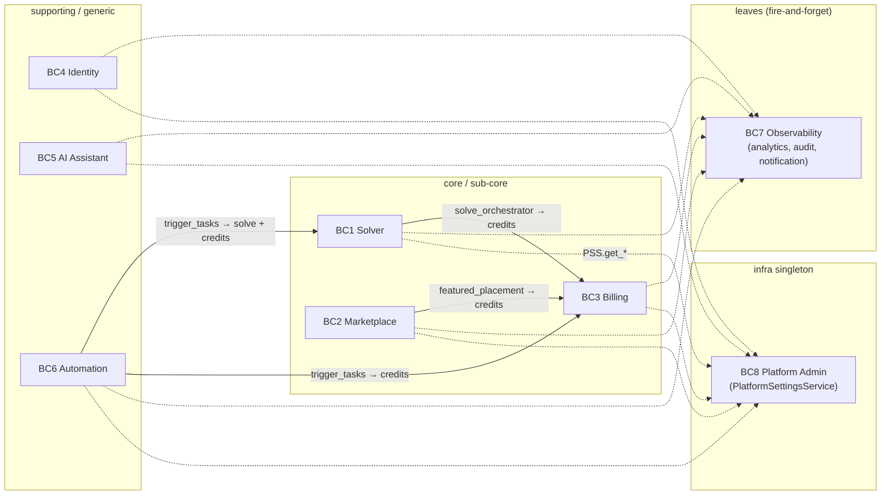

# Bounded Contexts — Summary

> Quick overview of the 8 contexts that make up JAOT. The authoritative source is [`docs/BOUNDED_CONTEXTS.md`](../../BOUNDED_CONTEXTS.md); this file is a single-screen view meant for understanding at a glance.

## The 8 contexts

| BC | Role | Coupling | Where it lives today | Extracted? |
|----|-----|--------------|----------------|-----------|
| **BC1 · Solver** | core | 2/5 | `app/domains/solver/` | **yes** — Phase 3 |
| BC2 · Marketplace | sub-core | 3/5 | `app/services/` + `app/api/v2/routes/models/` | no — planned |
| BC3 · Billing | sub-core | 4/5 | `app/services/` (credits, stripe, invoice, reconciliation) | no — planned |
| BC4 · Identity | generic | 2/5 | `app/services/auth/`, `app/services/gdpr/`, User/Org/APIKey/RefreshToken models | no — planned |
| BC5 · AI Assistant | supporting | 2/5 | `app/services/llm/`, `app/services/rag/`, `document_extraction` | no — planned |
| BC6 · Automation | supporting | 4/5 | `app/services/` (trigger, schedule, webhook), `app/tasks/` | no — planned |
| BC7 · Observability | generic | 1/5 | `app/services/` (analytics, audit, notification) | no — **easiest candidate** |
| BC8 · Platform Admin | generic | 1/5 | `app/shared/` (`settings_registry.py`, `PlatformSettingsService`) | never extracted |

## Allowed synchronous dependencies diagram

**Legend:**
- Solid lines = allowed synchronous cross-context calls (whitelisted in `import-linter`).
- Dashed lines = fire-and-forget (no response contract).

## When to work in each context

- **Solver logic** → `app/domains/solver/` (adapters, services, routes, schemas, tasks).
- **Marketplace / model catalog** → `app/api/v2/routes/models/` + `app/services/seller_*`, `featured_placement`, `template_scorecard`.
- **Billing / Stripe / credits** → `app/services/credits_service.py`, `stripe_service.py`, `stripe_connect.py`.
- **Auth / signup / API keys / GDPR** → `app/services/auth/`, `app/services/gdpr/`.
- **LLM / RAG / formulation assistant** → `app/services/llm/`, `app/services/rag/`.
- **Triggers / schedules / webhooks** → `app/services/trigger_service.py`, `schedule_service.py`, `webhook_service.py`; async in `app/tasks/trigger_tasks.py`, `webhook_tasks.py`.
- **Analytics / audit / notifications** → `app/services/analytics_service.py`, `audit_service.py`, `notification_service.py`.
- **Platform settings / feature flags** → `app/services/settings_registry.py` + `PlatformSettingsService` (never `app/config.py`).

## Suggested extraction order

1. ✅ **Solver** (done, Phase 3).
2. **Observability** — pure leaf, no inbound dependencies, low risk.
3. **AI Assistant** — only uses `PSS`, independent.
4. **Identity** — fan-in of 32+, high priority for security reasons.
5. **Billing** — depends on Identity.
6. **Marketplace** — depends on Billing.
7. **Automation** — orchestrates 4 domains, goes last.
8. **Platform Admin** — stays in `app/shared/` (never extracted).
