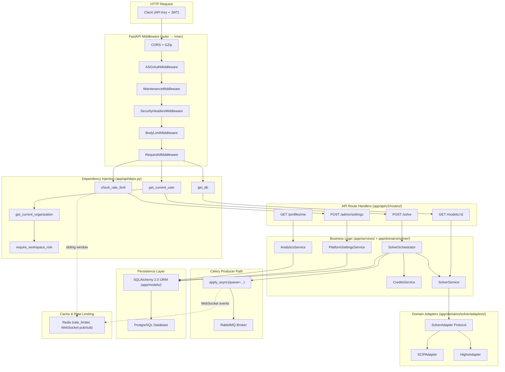

# Backend Layered Architecture

> Modular FastAPI with dependency injection, rate limiting, authentication, and asynchronous orchestration via Celery.

## Diagram

## Notes

- **Middlewares:** Pure ASGI, never `BaseHTTPMiddleware`. Auth always enabled (ADR-001).
- **Dependencies:** The 4 main ones injected in `app/api/deps.py` — `DBSession`, `CurrentUser`, `CurrentOrg`, `AdminUser`.
- **Rate-limiting:** `check_rate_limit(org_id, limit/min, limit/day)` on every endpoint — actual implementation in `app/shared/core/rate_limiter.py`.
- **ORM:** Typed SQLAlchemy 2.0 — `Mapped[str]`, `mapped_column(...)` in `app/models/`.
- **Celery:** Producer in FastAPI (injects `queue=...` via `resolve_queue()`), consumer in separate workers.
- **Config:** Two tiers — `app/config.py` (immutable infra) + `PlatformSettingsService` (runtime-mutable business config).
