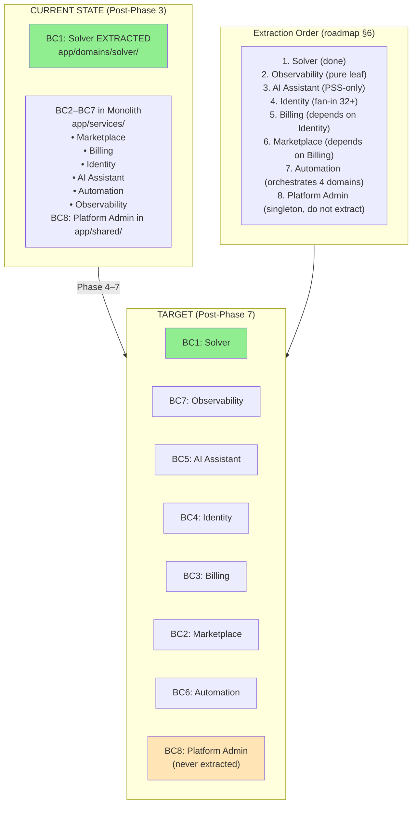

# Bounded Contexts — Current vs Target

> Modular monolith with 1 context extracted (Solver) and 7 pending. Authoritative reference: [`docs/BOUNDED_CONTEXTS.md`](../../BOUNDED_CONTEXTS.md).

## Diagram

## Notes

- **Solver (BC1):** Already extracted in Phase 3 (2026-04-13). Lives in `app/domains/solver/` with its own structure (adapters, routes, services, schemas, tasks).
- **The rest:** Still in `app/services/` as a monolith. The 6 `import-linter` contracts in `pyproject.toml` protect the Solver boundary.
- **Allowed synchronous paths (lint-imports):**
  - `solve_orchestrator` → `credits_service` (pre-pay/refund)
  - `trigger_tasks` → Solver + Credits
  - `featured_placement` → `credits_service`
- **Fire-and-forget:** Any context → `audit_service`, `analytics_service`, `notification_service` (leaves, no inbound dependencies).
- **Not microservices:** Modular monolith — one image, one process, one database. Logical boundaries via directories, `import-linter`, and typed `Protocol`s.
