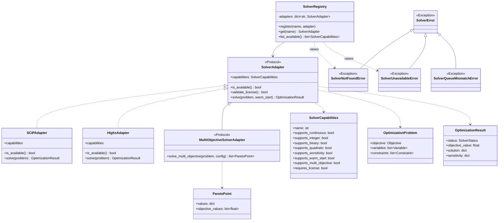

# Domain: Solver — UML Class Diagram

> First extracted bounded context. Protocols instead of ABCs; Protocol composition for multi-objective.

## Diagram

## Notes

- **`SolverAdapter`:** `typing.Protocol` without `@runtime_checkable` — static mypy is enough (PEP 544). `app/domains/solver/adapters/base.py`.
- **`SolverCapabilities`:** `frozen=True` dataclass, immutable metadata per adapter.
- **Exceptions:** 4 types. `SolverQueueMismatchError` raised by `_assert_queue_match()` if the container's `SOLVER_QUEUE` env var does not match the task's queue.
- **`MultiObjectiveSolverAdapter`:** opt-in for HiGHS/Hexaly in phases 5-7. SCIP (Phase 4) does not implement it — the orchestrator uses a weighted fallback.
- **Registry:** `SolverRegistry` immutable post-startup.
- **Queue routing:** `resolve_queue(solver_name)` (`queue_routing.py`) maps `"scip" → "solve_scip"`, `"highs" → "solve_highs"`.
- **Celery tasks:** `solve_async`, `solve_model_async` in `app/domains/solver/tasks/solve_tasks.py` — they call `_assert_queue_match()` as the first statement inside the outer `try`.
