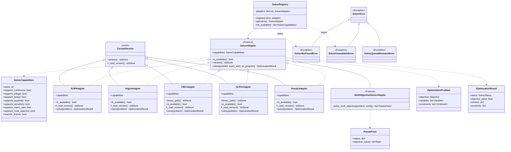

# Domain: Solver — UML Class Diagram

> First extracted bounded context. Protocols instead of ABCs; Protocol composition for multi-objective.

## Diagram

```mermaid
classDiagram
    class SolverCapabilities {
        +name: str
        +supports_continuous: bool
        +supports_integer: bool
        +supports_binary: bool
        +supports_quadratic: bool
        +supports_sensitivity: bool
        +supports_warm_start: bool
        +supports_multi_objective: bool
        +requires_license: bool
    }

    class SolverAdapter {
        <<Protocol>>
        +capabilities: SolverCapabilities
        +is_available() bool
        +version() str|None
        +solve(problem, warm_start, on_progress) OptimizationResult
    }

    class CachedVersion {
        <<mixin>>
        +version() str|None
        #_read_version() str|None
    }

    class SCIPAdapter {
        +capabilities
        +is_available() bool
        #_read_version() str|None
        +solve(problem) OptimizationResult
    }

    class HighsAdapter {
        +capabilities
        +is_available() bool
        #_read_version() str|None
        +solve(problem) OptimizationResult
    }

    class CBCAdapter {
        +capabilities
        +binary_path() str|None
        +is_available() bool
        #_read_version() str|None
        +solve(problem) OptimizationResult
    }

    class GLPKAdapter {
        +capabilities
        +binary_path() str|None
        +is_available() bool
        #_read_version() str|None
        +solve(problem) OptimizationResult
    }

    class HexalyAdapter {
        +capabilities
        +is_available() bool
        #_read_version() str|None
        +solve(problem) OptimizationResult
    }

    class MultiObjectiveSolverAdapter {
        <<Protocol>>
        +solve_multi_objective(problem, config) list~ParetoPoint~
    }

    class SolverError {
        <<Exception>>
    }
    class SolverNotFoundError {
        <<Exception>>
    }
    class SolverUnavailableError {
        <<Exception>>
    }
    class SolverQueueMismatchError {
        <<Exception>>
    }

    class OptimizationProblem {
        +objective: Objective
        +variables: list~Variable~
        +constraints: list~Constraint~
    }
    class OptimizationResult {
        +status: SolverStatus
        +objective_value: float
        +solution: dict
        +sensitivity: dict
    }
    class ParetoPoint {
        +values: dict
        +objective_values: list~float~
    }

    class SolverRegistry {
        -adapters: dict~str, SolverAdapter~
        +register(name, adapter)
        +get(name) SolverAdapter
        +list_available() list~SolverCapabilities~
    }

    SolverError <|-- SolverNotFoundError
    SolverError <|-- SolverUnavailableError
    SolverError <|-- SolverQueueMismatchError

    SolverAdapter <|.. SCIPAdapter
    SolverAdapter <|.. HighsAdapter
    SolverAdapter <|.. CBCAdapter
    SolverAdapter <|.. GLPKAdapter
    SolverAdapter <|.. HexalyAdapter
    SolverAdapter <|-- MultiObjectiveSolverAdapter

    CachedVersion <|-- SCIPAdapter
    CachedVersion <|-- HighsAdapter
    CachedVersion <|-- CBCAdapter
    CachedVersion <|-- GLPKAdapter
    CachedVersion <|-- HexalyAdapter

    SolverAdapter ..> SolverCapabilities
    SolverAdapter ..> OptimizationProblem
    SolverAdapter ..> OptimizationResult
    MultiObjectiveSolverAdapter ..> ParetoPoint
    SolverRegistry --> SolverAdapter
    SolverRegistry ..> SolverNotFoundError : raises
    SolverRegistry ..> SolverUnavailableError : raises
```

## Notes

- **`SolverAdapter`:** `typing.Protocol` without `@runtime_checkable` — static mypy is enough (PEP 544). `app/domains/solver/adapters/base.py`. `validate_license()` left the Protocol in Phase 7.4 / D-10: Hexaly loads the platform licence in `__init__` and fail-fasts, so there is no per-request gate.
- **`CachedVersion`:** the one place "ask the solver its version, once per process" is written. Inheritance rather than a fifth copy of the same four lines — that copy-paste is how HexalyAdapter ended up without a cache, re-reading package metadata on every solver listing. Two of the five start a child process to answer, so the cache is not cosmetic. `app/domains/solver/adapters/base.py`.
- **`CBCAdapter` / `GLPKAdapter`:** command-line solvers driven as separate processes, never linked (GLPK is GPLv3 and JAOT is Apache-2.0). They report their own absence through `is_available()`, so an image built without the binary simply does not list them.
- **`SolverCapabilities`:** `frozen=True` dataclass, immutable metadata per adapter.
- **Exceptions:** 4 types. `SolverQueueMismatchError` raised by `_assert_queue_match()` if the container's `SOLVER_QUEUE` env var does not match the task's queue.
- **`MultiObjectiveSolverAdapter`:** opt-in for HiGHS/Hexaly in phases 5-7. SCIP (Phase 4) does not implement it — the orchestrator uses a weighted fallback.
- **Registry:** `SolverRegistry` immutable post-startup.
- **Queue routing:** `resolve_queue(solver_name)` (`queue_routing.py`) maps `"scip" → "solve_scip"`, `"highs" → "solve_highs"`.
- **Celery tasks:** `solve_async`, `solve_model_async` in `app/domains/solver/tasks/solve_tasks.py` — they call `_assert_queue_match()` as the first statement inside the outer `try`.
