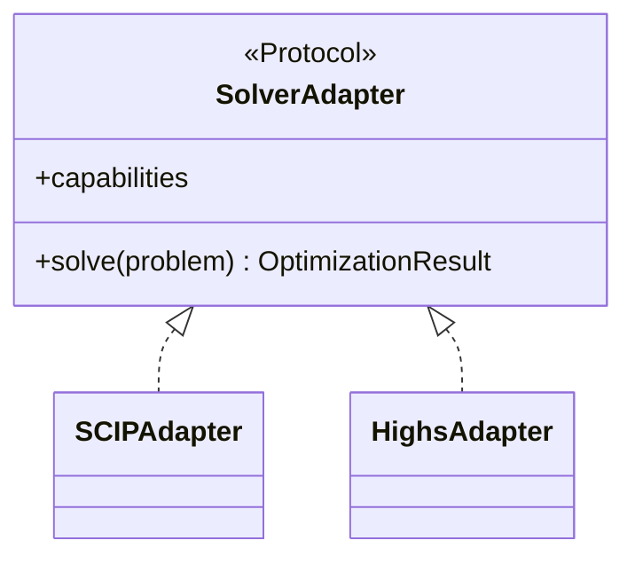
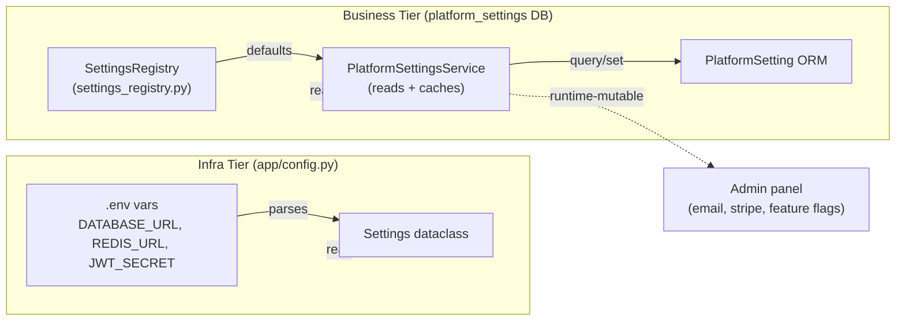
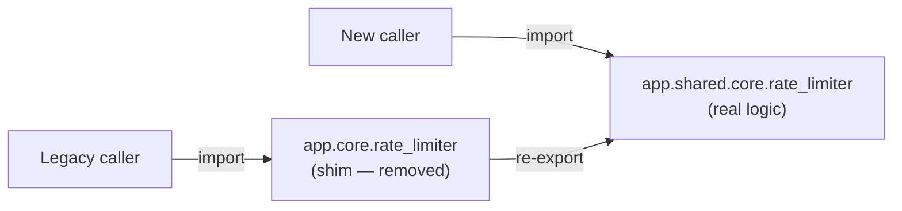

# Design Patterns — Mini Diagrams

> Key patterns underpinning the layered architecture and the Solver domain.

## 1. Protocol-Based Adapter

> Structural contract (statically verified duck typing), no base class inheritance.



**Location:** `app/domains/solver/adapters/base.py`.
**Decision:** Protocol over ABC (ADR-001). Third parties don't need to inherit; mypy catches violations statically.

---

## 2. Dependency Injection in FastAPI

> Auth, DB, rate limiter, and business flags centralized in a single layer.

```mermaid
flowchart TB
    Endpoint["POST /solve"]

    subgraph FastAPIDI["FastAPI Depends()"]
        CurrentUser["Depends(get_current_user)"]
        DBSession["Depends(get_db)"]
        RateLimiter["Depends(check_rate_limit)"]
        MaintenanceGate["Depends(solve_maintenance_gate)"]
    end

    subgraph Custom["Custom deps"]
        WorkspaceRole["Depends(require_workspace_role(ADMIN))"]
    end

    Endpoint --> CurrentUser
    Endpoint --> DBSession
    Endpoint --> RateLimiter
    Endpoint --> MaintenanceGate
    Endpoint --> WorkspaceRole

    CurrentUser -->|extracts JWT, validates org| User["User"]
    DBSession -->|SessionLocal()| Session["Session"]
    RateLimiter -->|sliding window| RLCheck["allowed, metadata"]
    MaintenanceGate -->|PSS.get_bool| Flag["SOLVE_MAINTENANCE_MODE"]
    WorkspaceRole -->|DB lookup + owner bypass| Member["WorkspaceMember"]
```

**Location:** `app/api/deps.py`, `app/api/v2/deps/solve_maintenance_gate.py`.
**Pattern:** `Annotated[Type, Depends(fn)]` for static typing + automatic FastAPI resolution.

---

## 3. Two-Tier Config

> Immutable infrastructure + runtime-mutable business config.



**Location:** `app/config.py` (infra) + `app/services/settings_registry.py` + `app/services/platform_settings_service.py` (business).
**Rule (CLAUDE.md):** never add plan/pricing/feature bools to `app/config.py`. All business config → `platform_settings` table.

---

## 4. Celery Task Routing via Producer

> Queue decided at publish time, not in static configuration.

```mermaid
flowchart LR
    Endpoint["POST /solve<br/>solver='scip'"]
    Resolve["resolve_queue('scip')"]
    ApplyAsync["apply_async(queue='solve_scip')"]
    RabbitMQ["RabbitMQ<br/>queue: solve_scip"]
    Worker["Worker<br/>SOLVER_QUEUE=solve_scip"]
    AssertQueue["_assert_queue_match"]
    Mismatch["SolverQueueMismatchError"]

    Endpoint --> Resolve
    Resolve -->|scip → solve_scip| ApplyAsync
    ApplyAsync -->|publish| RabbitMQ
    RabbitMQ -->|route| Worker
    Worker -->|startup| AssertQueue
    AssertQueue -->|mismatch| Mismatch
```



**Location:** `app/domains/solver/queue_routing.py` (`resolve_queue`) + `app/domains/solver/tasks/solve_tasks.py` (`_assert_queue_match`).
**Advantage:** scale workers independently per solver (spawn N workers with `SOLVER_QUEUE=solve_highs`) without touching producer logic.

---

## 5. Shim Architecture (Resolved — historical)

> Module alias for backward compatibility. The "old" module re-exports from the canonical one.



**Status:** `app/core/` has been removed. All callers now import directly from `app/shared/core/`. This pattern is documented for historical context; D-01 in [TECH_DEBT.md](../TECH_DEBT.md) tracks it as resolved.

---

## Summary Table

| Pattern | File | Purpose |
|--------|---------|-----------|
| Protocol Adapter | `app/domains/solver/adapters/base.py` | Flexible contract for solvers |
| FastAPI DI | `app/api/deps.py` | Centralized auth + DB + validation |
| Two-Tier Config | `app/config.py` + `settings_registry.py` | Immutable infra + mutable business config |
| Celery Queue Routing | `queue_routing.py` + `solve_tasks.py` | Dynamic queue per solver |
| Shim Architecture | *(removed — `app/core/` gone)* | Backward compat during refactor (resolved) |
