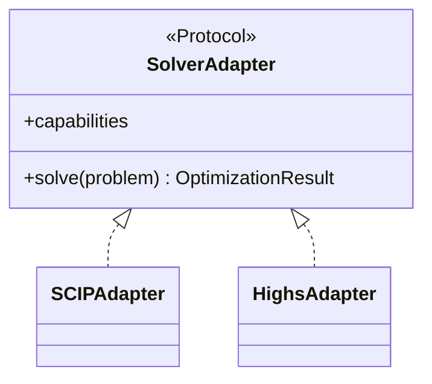
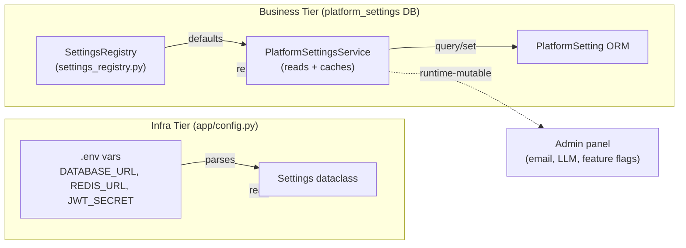
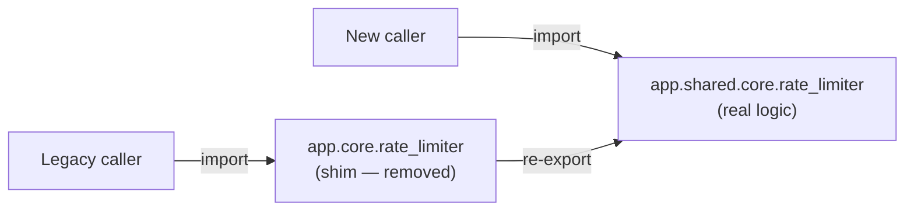

# Design Patterns — Mini Diagrams

> Key patterns underpinning the layered architecture and the Solver domain.

## 1. Protocol-Based Adapter

> Structural contract (statically verified duck typing), no base class inheritance.


```mermaid
classDiagram
    class SolverAdapter {
        <<Protocol>>
        +capabilities
        +solve(problem) OptimizationResult
    }
    class SCIPAdapter
    class HighsAdapter
    SolverAdapter <|.. SCIPAdapter
    SolverAdapter <|.. HighsAdapter
```

**Location:** `app/domains/solver/adapters/base.py`.
**Decision:** Protocol over ABC (ADR-001). Third parties don't need to inherit; mypy catches violations statically.

---

## 2. Dependency Injection in FastAPI

> Auth, DB, rate limiter, and business flags centralized in a single layer.

```mermaid
flowchart TB
    Endpoint["POST /solve"]

    subgraph FastAPIDI["FastAPI Depends()"]
        CurrentUser["Depends(get_current_user)"]
        DBSession["Depends(get_db)"]
        RateLimiter["Depends(check_rate_limit)"]
        MaintenanceGate["Depends(solve_maintenance_gate)"]
    end

    subgraph Custom["Custom deps"]
        WorkspaceRole["Depends(require_workspace_role(ADMIN))"]
    end

    Endpoint --> CurrentUser
    Endpoint --> DBSession
    Endpoint --> RateLimiter
    Endpoint --> MaintenanceGate
    Endpoint --> WorkspaceRole

    CurrentUser -->|extracts JWT, validates org| User["User"]
    DBSession -->|SessionLocal()| Session["Session"]
    RateLimiter -->|sliding window| RLCheck["allowed, metadata"]
    MaintenanceGate -->|PSS.get_bool| Flag["SOLVE_MAINTENANCE_MODE"]
    WorkspaceRole -->|DB lookup + owner bypass| Member["WorkspaceMember"]
```

**Location:** `app/api/deps.py`, `app/api/v2/deps/solve_maintenance_gate.py`.
**Pattern:** `Annotated[Type, Depends(fn)]` for static typing + automatic FastAPI resolution.

---

## 3. Two-Tier Config

> Immutable infrastructure + runtime-mutable business config.


```mermaid
flowchart LR
    subgraph Infra["Infra Tier (app/config.py)"]
        Env[".env vars<br/>DATABASE_URL, REDIS_URL, JWT_SECRET"]
        Config["Settings dataclass"]
        Env -->|parses| Config
    end

    subgraph Business["Business Tier (platform_settings DB)"]
        Registry["SettingsRegistry<br/>(settings_registry.py)"]
        PlatformSetting["PlatformSetting ORM"]
        PSS["PlatformSettingsService<br/>(reads + caches)"]
        Registry -->|defaults| PSS
        PSS -->|query/set| PlatformSetting
    end

    Config -->|read| Infra
    PSS -->|read| Business
    PSS -.->|runtime-mutable| Runtime["Admin panel<br/>(email, LLM, feature flags)"]
```

**Location:** `app/config.py` (infra) + `app/services/settings_registry.py` + `app/services/platform_settings_service.py` (business).
**Rule (CLAUDE.md):** never add plan/pricing/feature bools to `app/config.py`. All business config → `platform_settings` table.

---

## 4. Celery Task Routing via Producer

> Queue decided at publish time, not in static configuration.


```mermaid
flowchart LR
    Endpoint["POST /solve<br/>solver='scip'"]
    Resolve["resolve_queue('scip')"]
    ApplyAsync["apply_async(queue='solve_scip')"]
    RabbitMQ["RabbitMQ<br/>queue: solve_scip"]
    Worker["Worker<br/>SOLVER_QUEUE=solve_scip"]
    AssertQueue["_assert_queue_match"]
    Mismatch["SolverQueueMismatchError"]

    Endpoint --> Resolve
    Resolve -->|scip → solve_scip| ApplyAsync
    ApplyAsync -->|publish| RabbitMQ
    RabbitMQ -->|route| Worker
    Worker -->|startup| AssertQueue
    AssertQueue -->|mismatch| Mismatch
```

**Location:** `app/domains/solver/queue_routing.py` (`resolve_queue`) + `app/domains/solver/tasks/solve_tasks.py` (`_assert_queue_match`).
**Advantage:** scale workers independently per solver (spawn N workers with `SOLVER_QUEUE=solve_highs`) without touching producer logic.

---

## 5. Shim Architecture (Resolved — historical)

> Module alias for backward compatibility. The "old" module re-exports from the canonical one.


```mermaid
flowchart LR
    Caller1["Legacy caller"]
    Caller2["New caller"]
    Shim["app.core.rate_limiter<br/>(shim — removed)"]
    Real["app.shared.core.rate_limiter<br/>(real logic)"]

    Caller1 -->|import| Shim
    Caller2 -->|import| Real
    Shim -->|re-export| Real
```

**Status:** `app/core/` has been removed. All callers now import directly from `app/shared/core/`. This pattern is documented for historical context; D-01 in [TECH_DEBT.md](../TECH_DEBT.md) tracks it as resolved.

---

## 6. A Refusal Names Itself

**Problem:** the API answers in English — that is the contract, and it is what a
log and a non-browser client read. A page in one of the other four languages
that prints `detail` shows English inside translated text, and the reader
cannot act on the one sentence that matters.

**Pattern:** the message stays as it is, and the refusal carries a **code** and
its **params** alongside. The screen renders the code's translation; when there
is no code, or no text for it in that language, it falls back to the English
message rather than to nothing.

```python
# app/shared/core/http_errors.py
raise CodedHTTPException(
    status_code=404,
    detail="Execution not found",      # unchanged, English, the contract
    code="execution.not_found",        # what a translated page renders
    params={},                         # values its sentence needs
)
```

```tsx
// the screen
const tError = useTranslations("errors.codes");
setError(translateApiError(err, tError, t("failedToLoad")));
```

**Where it already applies**

| Source | Carrier |
|---|---|
| HTTP refusals | `CodedHTTPException` (`code`, `params`) |
| JModel compile errors | `JModelError.code` → `DSLCompileError.code` |
| FastAPI's 422 body | read by `frontend/src/lib/validation-error.ts`, which names the field |
| File import | `FileImportError.code` → `_import_refused` |
| Upload refused for lack of room | `upload_capacity.upload_refusal` writes the whole body |

**Rules of the road**

- Never change `detail` to translate something. Add a code.
- The code namespace mirrors the message file: `errors.codes.<group>.<name>`.
- A code without its five translations is worse than no code, because the
  fallback then shows the key. `npm run check-i18n` catches a missing locale.
- Structured data goes in `params`, never inside the sentence: an operator
  reads `setting_key`, a person reads the sentence.

---

## 7. A Workspace Is a Wall

> The row's own `workspace_id` decides. The one in the request never does.

The `OptionalRequire*` dependencies read `workspace_id` from the query string,
and the caller writes the query string. So the role check answered a question
the caller had asked itself. A viewer refused
`PUT /projects/<id>/draft?workspace_id=<ws>` sent the same call without the
parameter and got 200.

Two rules come out of that, and both have produced defects:

1. **Load the row and read its own `workspace_id`.** `enforce_project_workspace`
   in `app/api/deps.py` does this, and `_project_or_404` /
   `_writable_project_or_404` in `app/api/v2/projects.py` call it on every
   route that loads a model. An identifier that arrives in the body is a value
   to check, never an authority.
2. **Anything reached through a child id asks the same question.** A scenario, a
   committed version and a run are behind the wall of the model they belong to.
   Filtering by `organization_id` alone is not enough: the list of scenarios
   refused a non-member while one scenario by its id handed back every value.
   `execution_or_404` (`app/api/v2/_access.py`) and `load_execution`
   (`app/domains/solver/routes/_helpers.py`) take the caller with **no default**
   for that reason — a default would let the next endpoint inherit the hole in
   silence.

An org-wide list cannot ask per row. `workspace_ids_open_to` returns the
workspaces the caller may read (`None` for the organization owner, who enters
all of them), and the list filters the walled rows out before paginating.

A row filed in no workspace is organization-level and unaffected.

**Where the wall lives:** `app/api/deps.py` —
`check_workspace_role`, `enforce_project_workspace`,
`enforce_execution_workspace`, `workspace_ids_open_to`. It sits there rather
than in `app/api/v2/_access.py` because the export and insights routes are
inside the solver domain, and the import contract lets a domain route reach
`app.api.deps` and nothing else of the API layer.

---

## Summary Table

| Pattern | File | Purpose |
|--------|---------|-----------|
| Protocol Adapter | `app/domains/solver/adapters/base.py` | Flexible contract for solvers |
| FastAPI DI | `app/api/deps.py` | Centralized auth + DB + validation |
| Two-Tier Config | `app/config.py` + `settings_registry.py` | Immutable infra + mutable business config |
| Celery Queue Routing | `queue_routing.py` + `solve_tasks.py` | Dynamic queue per solver |
| Shim Architecture | *(removed — `app/core/` gone)* | Backward compat during refactor (resolved) |
| Coded refusal | `app/shared/core/http_errors.py` + `errors.codes` messages | English on the wire, the reader's language on screen |
| Workspace wall | `app/api/deps.py` (`enforce_project_workspace`, `enforce_execution_workspace`) | The row's own workspace decides, never the query string |
