# Import-Linter Contracts

> 5 contracts in `pyproject.toml [tool.importlinter]` protecting the boundaries between layers and domains. Contracts 3+5 were collapsed in a single merge (D-16) — the enforcement surface is unchanged.

## Diagram

```mermaid
flowchart TB
    subgraph C1["Contract 1: app/ never imports tests/"]
        A1["app/"]
        T1["tests/"]
        A1 -->|FORBIDDEN| T1
    end

    subgraph C2["Contract 2: tests/ subdirs independent"]
        TApi["tests.api"]
        TAuth["tests.auth"]
        TUnit["tests.unit"]
        TInt["tests.integration"]
        TApi -.-> TAuth
        TAuth -.-> TUnit
        TUnit -.-> TInt
    end

    subgraph C3["Contract 3: shared/ does not import domains/ or api/"]
        Shared["app/shared/"]
        Domains["app/domains/"]
        API["app/api/"]
        Shared -->|FORBIDDEN| Domains
        Shared -->|FORBIDDEN| API
    end

    subgraph C4["Contract 4: domains/ independent of each other"]
        Solver["app.domains.solver"]
        Obs["app.domains.observability (future)"]
        Id["app.domains.identity (future)"]
        Solver -.-> Obs
        Obs -.-> Id
    end

    subgraph C5["Contract 5: solver services cannot import pyscipopt directly"]
        SolverServices["app.domains.solver.services"]
        Pyscipopt["pyscipopt (third-party)"]
        SolverServices -->|FORBIDDEN| Pyscipopt
    end

    subgraph C3detail["Contract 3 also covers legacy shim paths (merged D-16)"]
        SharedMod["app.shared"]
        Shim1["app.services.solver"]
        Shim2["app.api.v2.routes.solve"]
        SharedMod -->|FORBIDDEN| Shim1
        SharedMod -->|FORBIDDEN| Shim2
    end
```



## Definition (`pyproject.toml` excerpt)

```toml
# Contract 1
[[tool.importlinter.contracts]]
id = "app-not-import-tests"
type = "forbidden"
source_modules = ["app"]
forbidden_modules = ["tests"]

# Contract 2
[[tool.importlinter.contracts]]
id = "tests-no-circular-imports"
type = "independence"
modules = ["tests.api", "tests.auth", "tests.unit", "tests.integration"]

# Contract 3 (merged from former 3+5 — D-16)
[[tool.importlinter.contracts]]
id = "shared-and-solver-domain-no-shim-imports"
type = "forbidden"
source_modules = ["app.shared"]
forbidden_modules = [
    "app.domains",
    "app.api",
    "app.services.solver",
    "app.api.v2.routes.solve",
]

# Contract 4
[[tool.importlinter.contracts]]
id = "domains-independent"
type = "independence"
modules = ["app.domains"]

# Contract 5
[[tool.importlinter.contracts]]
id = "solver-services-no-pyscipopt"
type = "forbidden"
source_modules = ["app.domains.solver.services"]
forbidden_modules = ["pyscipopt"]
```

## Notes

- **Execution:** `python -m importlinter` or `lint-imports` (before commit, integrated into CI).
- **Fire-and-forget:** `audit_service`, `analytics_service`, `notification_service` are leaves — any context can call them without reverse coupling.
- **Commit that validated contract 5:** `8fe5dbdf` — `queue_routing` had to move from `app/shared/core/` to `app/domains/solver/` to avoid violating this contract. A symptom of merging without prior CI validation.
- **D-16:** contracts 3+5 were collapsed into one contract (`shared-and-solver-domain-no-shim-imports`) — same enforcement surface, one fewer contract. See [TECH_DEBT.md](../TECH_DEBT.md) D-02.
