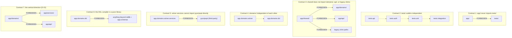

# Import-Linter Contracts

> 7 contracts in `pyproject.toml [tool.importlinter]` protecting the boundaries between
> layers and domains. Run with `lint-imports`; enforced in CI.

## Diagram

```mermaid
flowchart TB
    subgraph C1["Contract 1: app/ never imports tests/"]
        A1["app/"]
        T1["tests/"]
        A1 -->|FORBIDDEN| T1
    end

    subgraph C2["Contract 2: tests/ subdirs independent"]
        TApi["tests.api"]
        TAuth["tests.auth"]
        TUnit["tests.unit"]
        TInt["tests.integration"]
        TApi -.-> TAuth
        TAuth -.-> TUnit
        TUnit -.-> TInt
    end

    subgraph C3["Contract 3: shared/ does not import domains/, api/, or legacy shims"]
        Shared["app/shared/"]
        Domains["app/domains/"]
        API["app/api/"]
        Shim["legacy shim paths"]
        Shared -->|FORBIDDEN| Domains
        Shared -->|FORBIDDEN| API
        Shared -->|FORBIDDEN| Shim
    end

    subgraph C4["Contract 4: domains/ independent of each other"]
        Solver["app.domains.solver"]
        Dsl["app.domains.dsl"]
        Solver -.-> Dsl
    end

    subgraph C5["Contract 5: solver services cannot import pyscipopt directly"]
        SolverServices["app.domains.solver.services"]
        Pyscipopt["pyscipopt (third-party)"]
        SolverServices -->|FORBIDDEN| Pyscipopt
    end

    subgraph C6["Contract 6: the DSL compiler is a pure library"]
        DslDomain["app.domains.dsl"]
        Anything["anything beyond stdlib + app.schemas"]
        DslDomain -->|FORBIDDEN| Anything
    end

    subgraph C7["Contract 7: the vertical direction (D-15)"]
        Domains7["app/domains/"]
        Services7["app/services/"]
        Api7["app/api/"]
        Domains7 -->|FORBIDDEN| Services7
        Domains7 -->|FORBIDDEN| Api7
    end
```

## The 7 contracts (`pyproject.toml` is the source of truth)

| # | id | Type | Guards |
|---|----|------|--------|
| 1 | `app-not-import-tests` | forbidden | `app/` never imports `tests/` |
| 2 | `tests-no-circular-imports` | independence | test subdirectories stay independent |
| 3 | `shared-and-solver-domain-no-shim-imports` | forbidden | `app/shared/` never imports `app/domains/`, `app/api/`, or the legacy shim paths (`app.services.solver`, `app.api.v2.routes.solve`) |
| 4 | `domains-independent` | independence | bounded contexts (`solver`, `dsl`) never import each other — siblings listed explicitly, because `independence` compares only the modules it is given |
| 5 | `solver-services-no-pyscipopt` | forbidden | solver *services* reach SCIP only through the adapters |
| 6 | `dsl-domain-pure` | forbidden | the DSL compiler imports nothing beyond stdlib + `app.schemas` |
| 7 | `domains-no-upward-imports` | forbidden | ADR-001's vertical direction: `app/domains/` never imports `app/services/` or `app/api/` |

## Contract 7 and the host ports (D-15 / D-16)

Contract 7 landed (D-15) carrying D-16's inventory of upward imports as `ignore_imports` —
frozen so the list could not grow while it was worked off. That list is now **empty of
debt** (2026-07-29): the solver domain's last platform needs became ports it declares in
`app/domains/solver/ports.py`, registered by JAOT at both boots
(`app/tasks/solver_ports.py` — API lifespan + Celery `include`). What remains ignored is
the stated rule, not debt:

- `app.domains.*.routes.* -> app.api.deps` and `-> app.api.v2.solve_pipeline` — a bounded
  context is a vertical slice, so a domain's own routes ARE its API layer (owner, 2026-07-29).
- `app.shared.core.celery_app -> app.services.email_service` — a transitive boot-time
  wiring edge, deferred inside `worker_process_init`; it was never the domain's import.

## Notes

- **Execution:** `lint-imports` (CI runs it; locally it lives in the `jaot-api-test` image).
- **Fire-and-forget:** `audit_service`, `analytics_service`, `notification_service` are
  leaves — any context can call them without reverse coupling. The solver domain does not
  even call them directly any more: it hands outcomes to its host through the solve-event
  sink port.
- **Commit that validated the shim guard:** `8fe5dbdf` — `queue_routing` had to move from
  `app/shared/core/` to `app/domains/solver/` to avoid violating it.
- **History:** original contracts 3 and 5 were collapsed into today's contract 3 — same
  enforcement surface, one fewer contract. Contract 6 (DSL purity) and contract 7 (vertical
  direction, D-15) were added later; see [TECH_DEBT.md](../TECH_DEBT.md) D-15/D-16.
