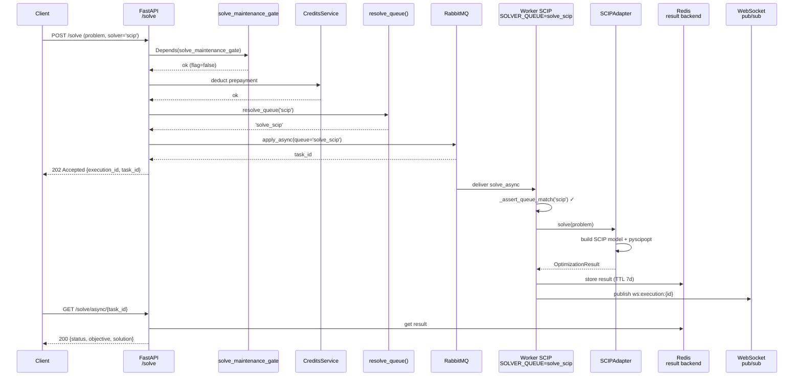
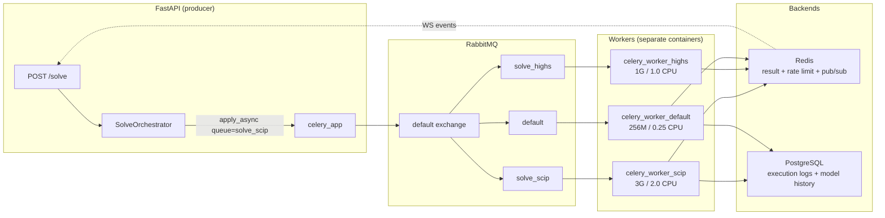
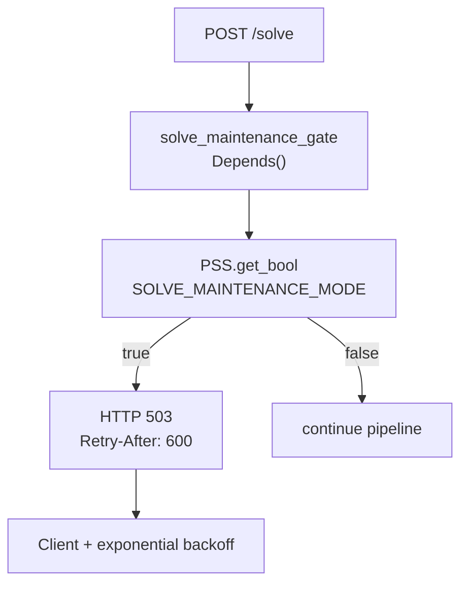

# Celery Flow — Producer → Broker → Worker → Result

> 3-layer asynchronous architecture: producer (FastAPI), RabbitMQ broker, workers specialized per solver.

## Sequence — One solve end-to-end

## Infrastructure topology

## Maintenance mode (SOLVE_MAINTENANCE_MODE)

## Celery configuration (`app/shared/core/celery_app.py`)

- **Broker:** RabbitMQ (AMQP) — `CELERY_BROKER_URL`
- **Result backend:** Redis with 7-day TTL
- **Acks:** `task_acks_late=True` (ack after completion)
- **Requeue:** `task_reject_on_worker_lost=True` (retries if the worker dies)
- **Static routes:** only `financial_tasks` → `default` (Beat scheduler)
- **Dynamic routes:** `solve_async` → `resolve_queue(solver_name)` in the producer
- **Events:** `worker_send_task_events=True` + `task_send_sent_event=True` → celery-exporter to Prometheus

## Notes

- **`_assert_queue_match`:** first statement inside the outer `try` in `solve_async` and `solve_model_async` (`solve_tasks.py`). Reads `os.getenv("SOLVER_QUEUE")` — env var injected by `docker-compose.prod.yml`. Raises `SolverQueueMismatchError` on mismatch, with a non-leaking message.
- **WebSocket:** Redis relays `ws:execution:{execution_id}` events for real-time updates to the client.
- **Retry TTL:** results expire after 7 days → GET returns 404.
- **Transactionality:** Credits pre-deducted; automatic refund on `SolverError` + entry in `audit_log`.
