# App Router Map

> Next.js 16 App Router. All routes live under `[locale]/`. Public / auth / dashboard / admin separation. The auth guard is a component wrapper (`<ProtectedRoute>`), not middleware.

## Diagram

```mermaid
flowchart TB
    Root["[locale]/ · Root Layout<br/>NextIntlClientProvider"]

    Root --> Providers["providers.tsx<br/>ThemeProvider → AuthProvider → GuidanceProvider<br/>+ WelcomeWizard + TooltipSingletonProvider + MaintenanceBanner"]

    Providers --> Public["(public) · public routes"]
    Providers --> AuthRoutes["auth routes"]
    Providers --> Dashboard["protected routes"]
    Providers --> AdminRoutes["admin routes"]
    Providers --> Maintenance["maintenance/ (503 page)"]

    Public --> PublicHome["/ · landing"]
    Public --> PublicDocs["/docs"]
    Public --> PublicForSellers["/for-sellers"]
    Public --> PublicLicenses["/licenses"]
    Public --> PublicContact["/contact"]
    Public --> PublicMarketplace["/marketplace"]

    AuthRoutes --> Login["login"]
    AuthRoutes --> Signup["signup"]
    AuthRoutes --> Forgot["forgot-password"]
    AuthRoutes --> Reset["reset-password"]
    AuthRoutes --> Verify["verify-email"]
    AuthRoutes --> Join["join (invite)"]

    Dashboard --> Workspace["workspace/* · main dashboard"]
    Dashboard --> Builder["builder/* · model builder"]
    Dashboard --> Solve["solve/* · solver UI"]
    Dashboard --> Triggers["triggers/* · automation"]
    Dashboard --> Billing["billing/* · credits + plan"]
    Dashboard --> User["user/* · settings, API keys"]
    Dashboard --> Org["org/* · members + plan"]

    AdminRoutes --> AdminDash["admin/* · stats, settings, maintenance toggle"]

    style Public fill:#E1F5E1
    style AuthRoutes fill:#FFF3CD
    style Dashboard fill:#CFE2FF
    style AdminRoutes fill:#F8D7DA
    style Maintenance fill:#F5C2C7
```

## Protection by type

| Type | Guard | File |
|------|---------|---------|
| Public | none | `frontend/src/app/[locale]/(public)/...` |
| Auth (sign-in) | redirect if already authenticated | logic in `LoginForm` / `SignupForm` |
| Dashboard | `<ProtectedRoute>` → `useAuth().isAuthenticated` | every `layout.tsx` wraps it |
| Admin | `<ProtectedRoute requireAdmin>` → `useAuth().isOwner` | `admin/layout.tsx` |
| Maintenance | auto-redirect when the API returns 503 with `status=maintenance` | `jaot:maintenance` event |

## Notes

- **There is no auth `middleware.ts`** — the guard lives in components. Simple, but it means server components cannot know whether the user is authenticated before rendering.
- **Route groups `(public)`** help visual organization without affecting the URL.
- **Shared layouts:** `workspace/layout.tsx` mounts sidebar + breadcrumbs; almost all dashboard routes reuse it.
- **Maintenance modal:** dispatched by `api.ts` when it detects a 503 with body `status=maintenance` (only on `/solve*` endpoints).
