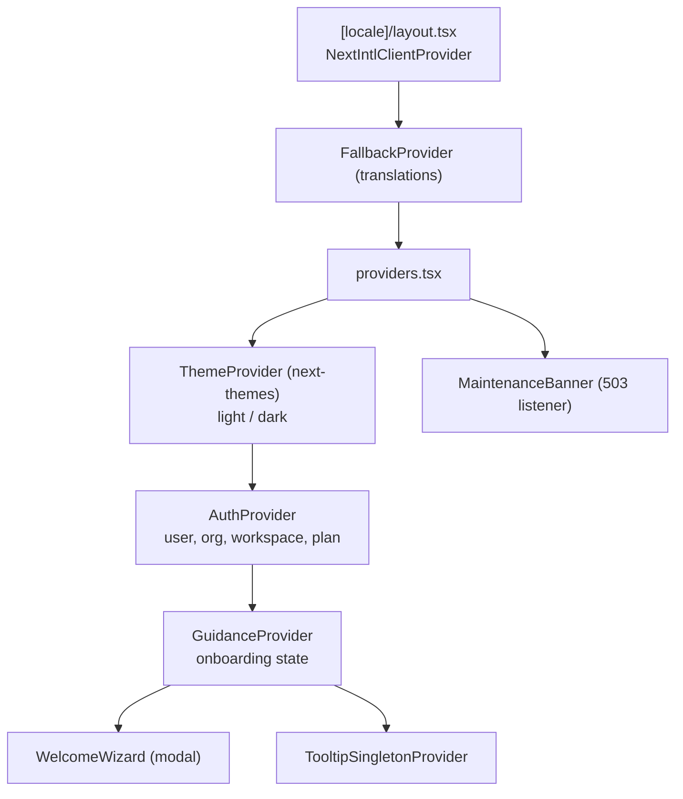
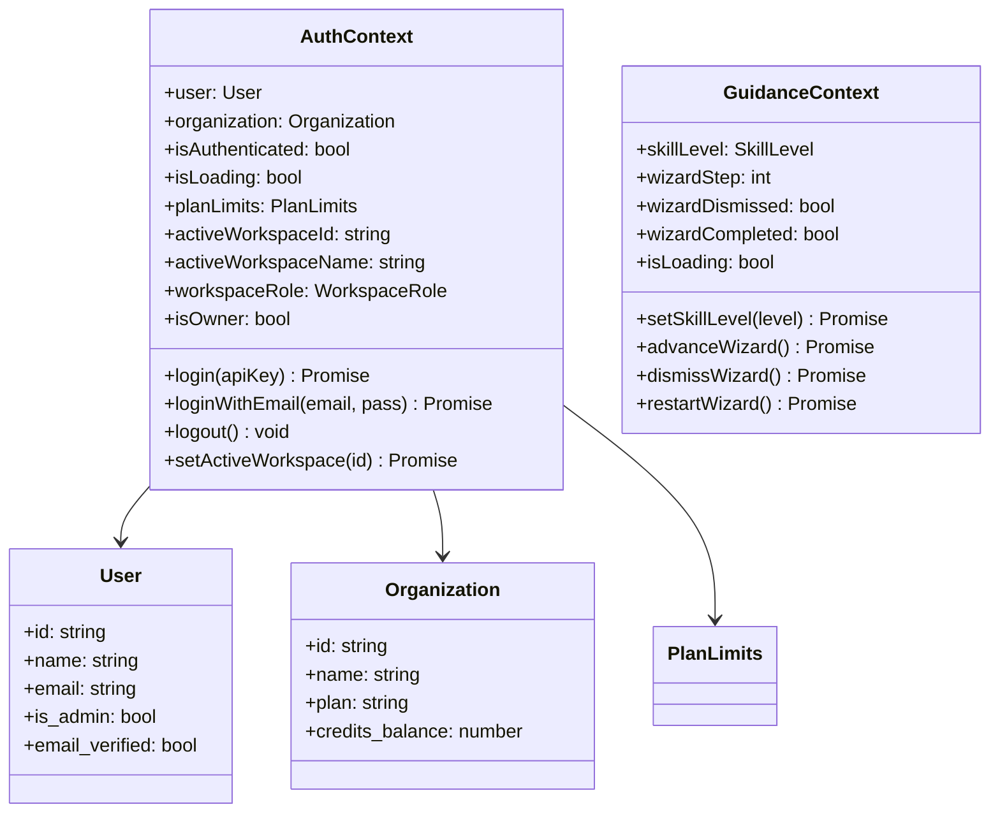

# State Management

> React Context for global shared state (auth, guidance, theme) + Zustand for feature-local state (builder). All providers live in `providers.tsx`.

## Provider stack

## Context UML

## Consumption

| Context | Hook | Consumers |
|----------|------|--------------|
| AuthContext | `useAuth()` | `ProtectedRoute`, `workspace/*`, `admin/*`, `user/*`, headers |
| GuidanceContext | `useGuidance()` | `WelcomeWizard`, `SkillLevelSelector`, `EmptyState` |
| Theme | `useTheme()` | `LanguageSwitcher`, header, footer |
| Zustand builder | `useBuilderStore()` | `BuilderCanvas`, `PropertiesPanel`, `VersionModal` |

Derived hooks:
- `usePermission()` / `useWorkspacePermission()` — roles and permissions.
- `useSolvers()` — solver list cache.
- `useWebSocket()` / `useSSE()` — execution status streaming.

## Notes

- **Dual persistence (debt):** `AuthContext` stores the API key in `localStorage` **and** the JWT in a cookie. If the localStorage token expires before the cookie, the 401 is recovered via `refreshAccessToken()` (see [`03-api-client.md`](./03-api-client.md)).
- **Overlapping workspace context:** `activeWorkspaceId/Name/Role` live in `AuthContext`. A reasonable candidate for splitting into an independent `WorkspaceContext`.
- **Session:** validated on mount, no polling. An expired token is only noticed on the next request (and is auto-refreshed).
