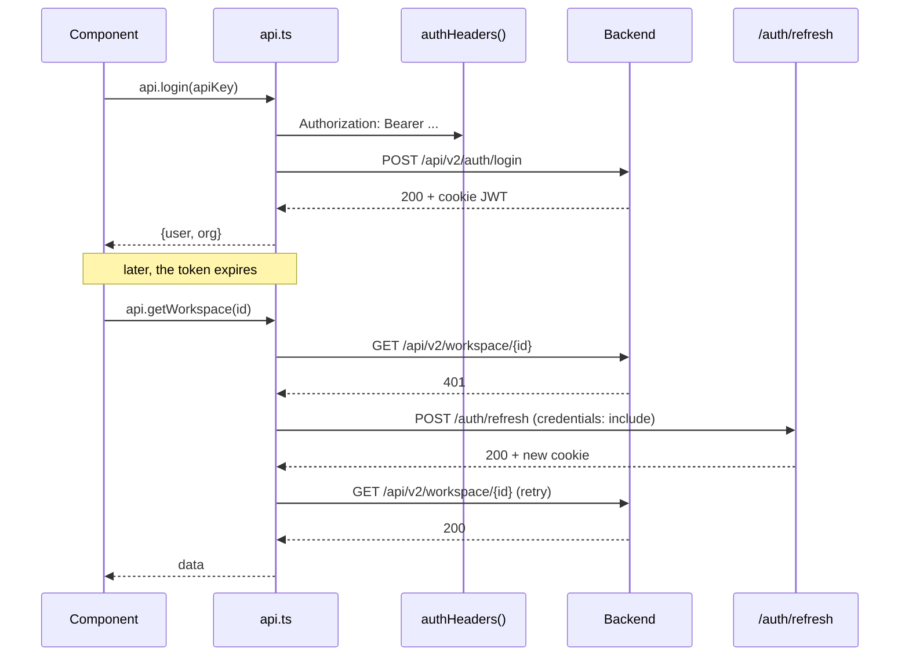
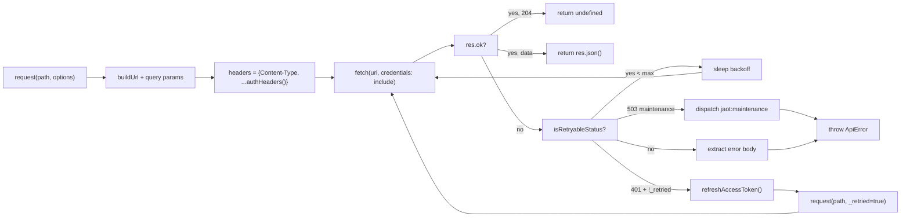

# API Client (`src/lib/api.ts`)

> Centralized HTTP client. Handles auth (Bearer + cookies), retry with exponential backoff, automatic refresh on 401, and 503 maintenance mode detection.

## Refresh flow

## Request pipeline

## Key mechanisms

| Mechanism | Description |
|-----------|-------------|
| `authHeaders()` | adds `Authorization: Bearer <apiKey>` if a key exists in `localStorage` |
| `refreshAccessToken()` | POST `/auth/refresh` with a singleton `refreshPromise` to avoid race conditions |
| 401 handling | auto-refresh + retry with `_retried` flag (no infinite loop) |
| 503 handling | parses `detail.status === "maintenance"` → dispatches event → `MaintenanceBanner` reacts |
| Exponential backoff | 1 s, 2 s, 4 s for retryable 5xx |
| `ApiError` class | status + message + detail (Pydantic errors) |

## Tech debt

- **Unsynchronized dual auth:** `localStorage` (Bearer) + cookie (JWT). A full logout should clear both; today it only clears localStorage.
- **No timeout on `fetch`:** requests can hang indefinitely. An `AbortController` with a timeout should be used.
- **No deduplication:** two components with the same `useEffect` fire two identical requests. A candidate for SWR / React Query if this grows.

## Referenced files

- `frontend/src/lib/api.ts` — ~1500 lines (`request`, `authHeaders`, `refreshAccessToken`, `ApiError`, all typed endpoints).
- `frontend/src/contexts/AuthContext.tsx` — `validateSession()` on mount + coordinated `logout()`.
