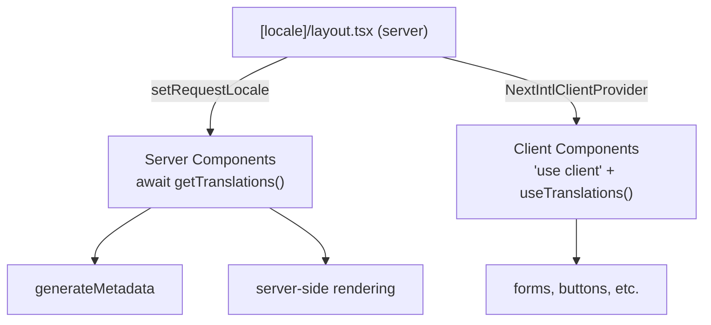

# Internationalization (next-intl)

> 5 locales: `en`, `es`, `ca`, `fr`, `de`. All routes live under `[locale]/*`. Locale detected by URL → cookie → default `en`.

## Request → translation

```mermaid
flowchart LR
    Req["GET /es/workspace"]
    Req --> Routing["next-intl routing<br/>src/i18n/routing.ts"]
    Routing --> Detect["detects locale (URL → cookie)"]
    Detect --> Fallback["fallback: defaultLocale = en"]
    Fallback --> Load["loads src/i18n/messages/{locale}.json"]
    Load --> Provider["NextIntlClientProvider"]
    Provider --> Hook["useTranslations() / getTranslations()"]
    Hook --> Render["t('key') → text"]
```



## Server vs Client



## Configuration (`src/i18n/routing.ts`)

```typescript
export const routing = defineRouting({
  locales: ["en", "es", "ca", "fr", "de"],
  defaultLocale: "en",
  localePrefix: "as-needed",    // /en/... omitted, others prefixed
  localeCookie: { name: "NEXT_LOCALE", maxAge: 60 * 60 * 24 * 365 },
});
```

## Message files

```
frontend/src/i18n/messages/
  en.json   (canonical source)
  es.json
  ca.json
  fr.json
  de.json
```

Keys nested by namespace:
```json
{
  "common": { "jaot": "JAOT", "optimizationAsAService": "..." },
  "admin.dashboard": { "title": "Admin Dashboard" }
}
```

## Usage

```typescript
// Server component
const t = await getTranslations({ locale, namespace: "common" });
const title = t("jaot");

// Client component ("use client")
const t = useTranslations("admin.dashboard");
return <h1>{t("title")}</h1>;
```

## Conventions

- **No inline strings** in code — everything goes through a JSON key.
- **Validation:** `npm run check-i18n` verifies that all keys exist in all 5 locales.
- **Plurals:** `intl-messageformat` (transitive dependency of next-intl).
- **LanguageSwitcher:** component in `src/components/i18n/LanguageSwitcher.tsx` does `router.replace` with the new locale.

## Debt

- **Cache busting:** if the JSON files change, the bundle includes them at build time. Without a redeploy, changes do not show up.
- **Fallback:** if a key is missing in `es.json` but not in `en.json`, rendering breaks; an automatic fallback to `en` would be better.
