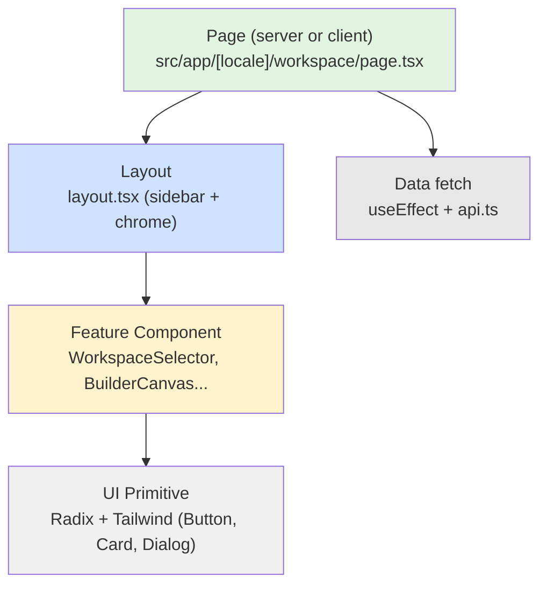

# Component Architecture

> React 19 Server Components by default. `"use client"` only where there is state, effects, or interaction. Radix UI + Tailwind CSS 4. Organized **by feature**, not by type.

## Hierarchy



## Component types

| Type | Description | Example |
|------|-------------|---------|
| Page | server by default | `workspace/page.tsx` |
| Layout | server, chrome | `workspace/layout.tsx` |
| Server Component | stateless; renders on the server | static content blocks |
| Client Component | `"use client"` + hooks | forms, buttons, interactive widgets |
| UI Primitive | Radix + Tailwind, reusable | `Button`, `Card`, `Dialog` |
| Feature Component | composes primitives + domain logic | `BuilderCanvas`, `WorkspaceSelector` |

## `src/components/` structure

```
components/
├── ui/                (Radix primitives)
├── auth/              (ProtectedRoute, LoginForm, SignupForm)
├── builder/           (BuilderCanvas xyflow, PropertiesPanel, Toolbar)
├── layout/            (Sidebar, Breadcrumbs, Footer, nav-items)
├── workspace/         (WorkspaceSelector, MemberList, InviteModal)
├── admin/             (Dashboard, SettingsRegistry, VerificationQueue)
├── solver/            (SolveForm, SolveResultsDrawer, ExecutionProgress)
├── triggers/          (TriggerScheduler, CronEditor, WebhookConfig)
├── guidance/          (WelcomeWizard, SkillLevelSelector, EmptyState)
├── marketplace/       (ModelListing, ReviewCard, FeaturedPlacement)
├── docs/              (DocsSidebar, SearchModal, CodeBlock)
├── notifications/     (NotificationList, PreferencesModal)
├── theme/             (ThemeProvider, ThemeToggle)
├── billing/           (CreditBalance, TransactionHistory, WithdrawalForm)
├── feedback/          (FeedbackForm)
├── i18n/              (LanguageSwitcher, FallbackProvider)
├── legal/             (CookieConsent, PrivacyLinks)
├── publish/           (PublishModal)
├── seller/            (SellerDashboard, EarningsChart)
├── tier/              (TierBadge)
├── llm/               (FileImportModal, AttachmentPreview)
└── maintenance/       (MaintenanceBanner)
```

## Design system

- **Tailwind CSS 4** — utility-first, dark mode via `next-themes`.
- **Radix UI** — accessible primitives (Dialog, Popover, Tooltip, Select).
- **Icons:** `lucide-react` (200+ icons).
- **Charts:** `recharts` (time series, pie, bar).
- **Rich editor:** Tiptap (markdown, tables, code blocks) in builder + docs.
- **Flow editor:** `@xyflow/react` in `BuilderCanvas`.

## Conventions

- Props with a named interface, never `React.FC`.
- Server Component by default — `"use client"` only when necessary.
- Images → `next/image`, never ``.
- Styles → Tailwind + `className`, no inline styles.
- Accessibility → Radix primitives (already ARIA-compliant).

## Debt

- **`BuilderCanvas`** concentrates too much (zustand store + xyflow + validation + serializer). A candidate for a split.
- **`AdminDashboard`** mixes stats + maintenance toggle + settings. Should be split into sub-pages.
- **`BuilderCanvas`** and **`AdminDashboard`** are candidates for further splitting (see items above).
