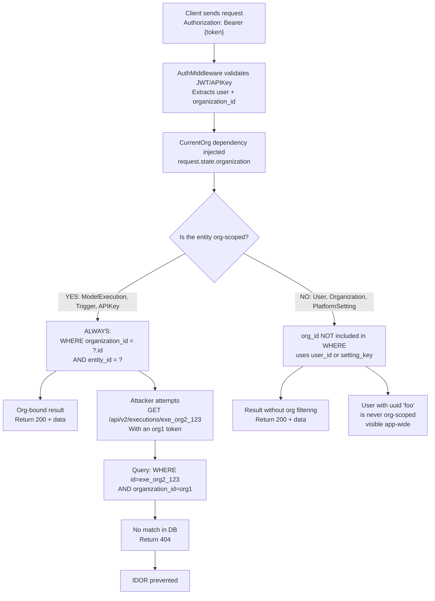

# Multi-Tenancy Architecture — org_id Filtering

> Critical security: every org-scoped query MUST filter by `organization_id`. Missing filters = IDOR vulnerability.

## Security Flow



## Org-Scoped Models (ALWAYS filter)

| Model | Mandatory filter | Risk |
|---|---|---|
| ModelExecution | `organization_id` | Exposes secrets, results |
| Trigger | `organization_id` | Webhook hijacking |
| APIKey | `organization_id` | API impersonation |
| LLMConversation | `organization_id` | Exposes prompts, customer data |
| ModelBuilderDocument | `organization_id` | Exposes formulations, strategies |
| CreditTransaction | `organization_id` | Financial fraud |
| Withdrawal | `organization_id` | Money theft |
| WorkspaceMember | `organization_id` + `workspace_id` | Role escalation |
| Workspace | `organization_id` | Data exfiltration |

## Non-Org-Scoped Models

| Model | Reason | Filter |
|---|---|---|
| User | 1 user → N orgs (future: multi-org) | `user_id` (PK) |
| Organization | Root entity | `id` (PK) |
| PlatformSetting | Global singleton | `key` (PK) |
| ModelCatalog | Global marketplace | `id` (PK) |
| AnalyticsEvent | Aggregated analytics | `user_id` + `organization_id` (both as filters) |

## Golden Rule: CurrentOrg Dependency

```python
from sqlalchemy import select

# CORRECT: controller receives CurrentOrg, uses SA 2.0 select()
@router.get("/executions/{execution_id}")
async def get_execution(
    execution_id: str,
    org: CurrentOrg,  # Dependency-injected
    db: DBSession,
):
    # Always filtered — SA 2.0 style
    stmt = (
        select(ModelExecution)
        .where(
            ModelExecution.id == execution_id,
            ModelExecution.organization_id == org.id,  # ← REQUIRED
        )
    )
    execution = (await db.execute(stmt)).scalar_one_or_none()
    return execution  # 404 if it does not belong to the org

# WRONG: No org_id filter = IDOR
@router.get("/executions/{execution_id}")
async def get_execution(execution_id: str, db: DBSession):
    stmt = select(ModelExecution).where(
        ModelExecution.id == execution_id
        # ← MISSING organization_id check = CRITICAL IDOR
    )
    execution = (await db.execute(stmt)).scalar_one_or_none()
    return execution
```

## Security Audit

### Pre-commit checks:
1. `ruff check app/` → bandit flags `session.query(...).filter()` without org_id
2. Lint-imports contracts → no cross-domain leaks
3. IDOR test: `test_user_a_cannot_access_user_b_resource()`

### Historical Violation Examples:
- **Phase 10**: ModelExecution without org_id filter → **CRITICAL**. Hotfix = revert + add filter.
- **Phase 42**: Workspace listing without org_id → **HIGH**. Enumeration attack.

## Refund/Rollback Specification

**Scenario**: A solve fails. If credits were already deducted, refund them.

```python
# Pre-pay pattern (SolveOrchestrator):
1. Deduct credits: CreditsService.deduct(org_id, credits, ref=execution_id)
   → CreditTransaction(type=EXECUTION, org_id, ref_id=execution_id)
2. Execute solve
3. IF failed:
   → CreditsService.refund(org_id, credits, ref_id=execution_id)
   → CreditTransaction(type=REFUND, org_id, ref_id=execution_id)

# Idempotency: UNIQUE constraint prevents double-refund
# (organization_id, transaction_type, reference_type, reference_id)
```

## Implementation Files

- `app/api/deps.py:CurrentOrg` — dependency resolver
- `app/core/auth_middleware.py` — JWT/APIKey extraction
- `app/api/v2/auth.py` — user management endpoints
- `app/services/credits_service.py:CreditsService.deduct/refund` — transactional safety
