# Alembic Migrations Pipeline

> Incremental schema versioning. Additive-only: never DROP/RENAME in the same release.

## CI/CD Flow

```mermaid
flowchart LR
    A["Developer changes a model<br/>app/models/optimization_model.py"] --> B["alembic revision --autogenerate<br/>-m 'add solver_name to executions'"]
    B --> C["Generates infra/alembic/versions/<br/>20260416_add_solver_name_to_executions.py"]
    C --> D["Review migration<br/>Verify there is no DROP/RENAME"]
    D --> E{"Is the change safe?"}
    E -->|NO| F["Reject + request fix<br/>e.g.: use RENAME with an alias"]
    E -->|YES| G["Commit migration file"]
    G --> H["CI: alembic upgrade head<br/>on test database"]
    H --> I{"Upgrade OK?"}
    I -->|NO| J["Fail CI + block merge<br/>Fix migration"]
    I -->|YES| K["Test suite runs<br/>against new schema"]
    K --> L["Merge to main"]
    L --> M["Deploy: alembic upgrade head<br/>on production DB"]
    M --> N["Schema updated"]
    
    N --> O["Rollback strategy:<br/>Container restart =<br/>prior image (prior schema)"]
```



## Current Migration Structure (35 total)

```
infra/alembic/versions/
├── 20260305_add_locale_to_users.py
├── 20260311_add_conversation_attachments.py
├── 20260311_add_trigger_schedules.py
├── 20260314_add_model_media_columns.py
├── 20260314_add_platform_settings.py
├── 20260315_add_analytics_events.py
├── 20260315_add_seller_experience_tables.py
├── 20260317_add_credit_idempotency_constraint.py
├── 20260317_add_owner_fk.py
├── 20260317_add_platform_setting_audit.py
├── 20260322_financial_hardening_schema.py
├── 20260324_rename_enterprise_to_business.py  ← RENAME (historical — already ran; no current risk)
├── 20260326_add_credit_pools.py
├── 20260327_seed_platform_settings.py
└── 20260416_add_solver_name_to_model_executions.py  ← Latest
```

### Last 5 Migrations

1. **20260416_add_solver_name_to_model_executions.py**
   - Adds `solver_name` column to `model_executions` table
   - Enables routable async queue per solver (SCIP vs HiGHS)
   - Default: 'scip'

2. **20260327_seed_platform_settings.py**
   - Inserts 84 default settings into `platform_settings`
   - Categories: billing, feature_flags, rate_limits, marketplace
   - Runs `PlatformSettingsService.register_defaults()`

3. **20260326_add_credit_pools.py**
   - Creates `workspace_credit_pools` table (workspace_id, allocated, consumed)
   - Enables per-workspace credit pooling vs org-level

4. **20260324_rename_enterprise_to_business.py**
   - Renames plan `enterprise` → `business`
   - **Note**: This RENAME already ran in production. It is historical; no current risk from it.

5. **20260322_financial_hardening_schema.py**
   - Adds financial integrity constraints:
     - Unique(organization_id, transaction_type, reference_type, reference_id) on credit_transactions
     - Indexes on (organization_id, created_at) for query efficiency

## Conventions + Rules

### Additive-Only

```python
# ✓ ALLOWED:
def upgrade():
    op.add_column('model_executions', sa.Column('solver_name', sa.String()))
    op.create_index('ix_solver_name', 'model_executions', ['solver_name'])

# ✗ FORBIDDEN (in the same release):
def upgrade():
    op.drop_column('model_executions', 'solver_name')  # Breaks rollback → schema mismatch

# ✓ ALLOWED (with dual-write alias):
def upgrade():
    op.add_column('model_executions', sa.Column('solver_name_v2', sa.String()))
    # App writes to both during the transition
```

### ID Generation

```python
# Migrations NEVER generate IDs manually
def upgrade():
    op.add_column('users', sa.Column('id', sa.String(), nullable=False, primary_key=True))
    # Relies on app/shared/utils/id_generator.py:generate_id() in app code

# For backfill:
# 1. Migration: ADD COLUMN (nullable)
# 2. App code: backfill script using generate_id()
# 3. Follow-up migration: ALTER NOT NULL
```

### Migration Testing

```bash
# Local test:
alembic -c infra/alembic.ini downgrade -1  # Roll back the latest
alembic -c infra/alembic.ini upgrade head   # Reapply
pytest tests/migrations/ -v

# CI:
# 1. Fresh DB: psql jaot_test < schema_dump.sql
# 2. alembic upgrade head
# 3. ruff check + pytest
# 4. Merge if everything is OK
```

## Pre-Commit Checklist

- [ ] Migration generated by `autogenerate` (not manual)
- [ ] No DROP/RENAME without a fallback plan
- [ ] IDs are prefixed strings (generate_id)
- [ ] FK: ondelete="CASCADE" for org-scoped
- [ ] Indexes on (organization_id, created_at) for ranges
- [ ] Constraints named explicitly: `name='uq_X'`
- [ ] Timestamps: DEFAULT utcnow(), NOT NULL
- [ ] Migration tested on the test DB before merge

## Configuration Files

- `infra/alembic.ini` — Alembic config (DB connection string)
- `infra/alembic/env.py` — Script runner (autogenerate detection)
- `app/models/` — ORM definitions (source of truth)
