# Docker Topology — Production

> Production service topology (IP `<SERVER_IP>`). Four isolated networks: frontend, backend, monitoring, plausible_backend. After Phase 6 the monolithic worker is split into specialized workers; Plausible analytics added in Phase 8.

## Diagram

```mermaid
graph TB
    Internet["Internet"]

    subgraph Server["Production host"]
        subgraph Frontend_Net["frontend network"]
            Caddy["Caddy (reverse proxy)<br/>TLS + rate limit<br/>80 / 443<br/>256M / 1.0 CPU"]
            Frontend["Frontend Next.js<br/>3000 internal<br/>512M / 1.0 CPU"]
        end

        subgraph Backend_Net["backend network"]
            API["API FastAPI + Uvicorn<br/>8001 internal<br/>4G / 4.0 CPU<br/>4 workers"]

            CeleryDefault["celery_worker_default<br/>-Q jaot_default<br/>256M / 0.25 CPU<br/>concurrency=2"]
            CeleryScip["celery_worker_scip<br/>-Q solve_scip<br/>3G / 2.0 CPU<br/>concurrency=2"]
            CeleryHighs["celery_worker_highs<br/>-Q solve_highs<br/>1G / 1.0 CPU<br/>concurrency=1"]
            CeleryHexaly["celery_worker_hexaly<br/>-Q solve_hexaly<br/>2G / 1.0 CPU<br/>profile: hexaly"]
            CeleryBeat["celery_beat<br/>DatabaseScheduler<br/>128M / 0.5 CPU"]

            PostgreSQL["PostgreSQL 18<br/>5432 internal<br/>1.5G / 2.0 CPU<br/>vol: postgres_data + wal_archive"]
            Redis["Redis 7<br/>6379 internal<br/>384M<br/>vol: redis_data"]
            RabbitMQ["RabbitMQ 3<br/>5672 / 15672 internal<br/>512M / 1.0 CPU<br/>vol: rabbitmq_data"]
            Qdrant["Qdrant (RAG)<br/>6333 internal<br/>384M / 1.0 CPU<br/>vol: qdrant_data"]
        end

        subgraph Plausible_Net["plausible_backend network (internal)"]
            PlausibleDB["plausible_db<br/>postgres:16<br/>512M"]
            PlausibleEvents["plausible_events_db<br/>clickhouse:24.12<br/>1G"]
            Plausible["plausible CE v3.2.0<br/>8800→8000 (SSH tunnel)<br/>2G"]
        end

        subgraph Monitoring_Net["monitoring network"]
            Prometheus["Prometheus<br/>9090 (127.0.0.1)<br/>512M / 0.5 CPU<br/>vol: prometheus_data"]
            Grafana["Grafana<br/>3001 (SSH tunnel)<br/>256M / 0.5 CPU"]
            Alertmanager["Alertmanager<br/>9093 internal<br/>64M"]

            NodeExp["node-exporter 9100<br/>64M"]
            Cadvisor["cAdvisor 8080<br/>128M"]
            PgExp["postgres-exporter 9187"]
            RedisExp["redis-exporter 9121"]
            CeleryExp["celery-exporter 9808<br/>sha256 pinned"]
            BlackboxExp["blackbox-exporter 9115"]
        end
    end

    Internet -->|HTTPS 443| Caddy
    Internet -->|HTTP 80 → 443| Caddy

    Caddy --> Frontend
    Caddy --> API

    API --> PostgreSQL
    API --> Redis
    API --> RabbitMQ
    API --> Qdrant

    CeleryDefault -->|consume jaot_default| RabbitMQ
    CeleryScip -->|consume solve_scip| RabbitMQ
    CeleryHighs -->|consume solve_highs| RabbitMQ
    CeleryHexaly -->|consume solve_hexaly| RabbitMQ
    CeleryBeat -->|schedule| RabbitMQ

    CeleryDefault --> PostgreSQL
    CeleryScip --> PostgreSQL
    CeleryHighs --> PostgreSQL
    CeleryHexaly --> PostgreSQL

    CeleryDefault --> Redis
    CeleryScip --> Redis
    CeleryHighs --> Redis
    CeleryHexaly --> Redis

    Plausible --> PlausibleDB
    Plausible --> PlausibleEvents

    Prometheus --> NodeExp
    Prometheus --> Cadvisor
    Prometheus --> PgExp
    Prometheus --> RedisExp
    Prometheus --> CeleryExp
    Prometheus --> BlackboxExp

    Prometheus --> Alertmanager
    Grafana -->|query PromQL| Prometheus
    CeleryExp -->|consume| RabbitMQ
```

## Notes

- **4 isolated Docker networks**: `frontend` (Caddy, Frontend, Plausible app, Blackbox), `backend` (API, workers, infra), `monitoring` (Prometheus, Grafana, exporters), `plausible_backend` (internal — Plausible postgres + ClickHouse, unreachable from outside).
- **Plausible CE analytics (Phase 8):** 3 containers — `plausible_db` (postgres:16), `plausible_events_db` (clickhouse:24.12), `plausible` (CE v3.2.0). Dashboard access via SSH tunnel to `127.0.0.1:8800`. Only `/js/script.js` and `/api/event` are publicly proxied through Caddy.
- **Total memory commitment:** SCIP 3G + HiGHS 1G + default 256M + Hexaly 2G = 6.25G (Hexaly is profile-gated).
- **Critical volumes:** `postgres_data` (daily backup), `wal_archive` (continuous PITR), `redis_data`, `rabbitmq_data`, `caddy_data` (TLS certs).
- **Security posture:** `cap_drop: ALL`, `read_only: true`, `tmpfs /tmp`, `security_opt: no-new-privileges:true` for all workers.
- **Hexaly worker:** `celery_worker_hexaly` is profile-gated (`profiles: ["hexaly"]`, 2G memory limit); activated with `--profile hexaly` and a platform license mount at `/etc/jaot/hexaly.lic`.
