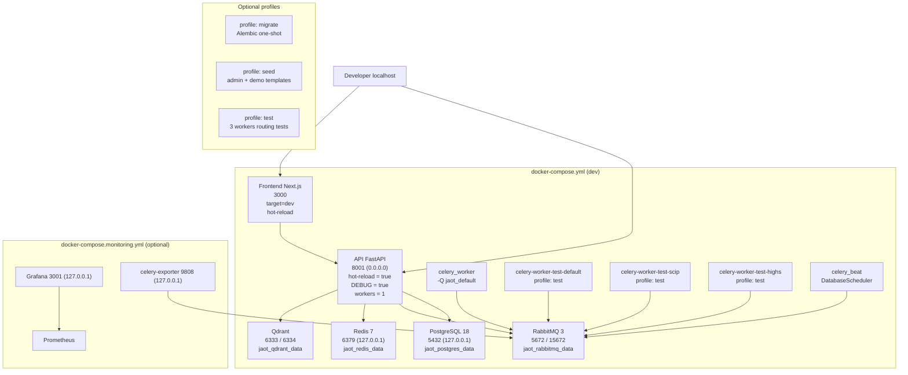

# Docker Topology — Local (Dev)

> Local stack with `docker-compose.yml` at the repo root. Mirrors prod but with hot-reload, debug enabled, and no resource limits (Docker Desktop ignores cgroups).

## Diagram

## Profiles

| Profile | Starts | Use |
|--------|---------|-----|
| _default_ | API + celery_worker + beat + frontend + infra | daily development |
| `test` | 3 workers with `-Q jaot_default`, `solve_scip`, `solve_highs` | routing tests (`tests/integration/test_queue_routing.py`) |
| `migrate` | one-shot | `alembic upgrade head` |
| `seed` | one-shot | dev preload (admin + 102 templates + demo models) |

## Notes

- **Hot-reload:** `RELOAD=true` on the API; Next.js with hot-module-reload.
- **Debugging:** `DEBUG=true`; infra exposed on `127.0.0.1` (connect with `psql`, `redis-cli`, DBeaver).
- **No limits:** Docker Desktop ignores `deploy.resources.limits` → allows reproducing without artificial OOM.
- **Optional monitoring:** `docker compose -f deploy/docker-compose.monitoring.yml up` starts a local mini-stack.
