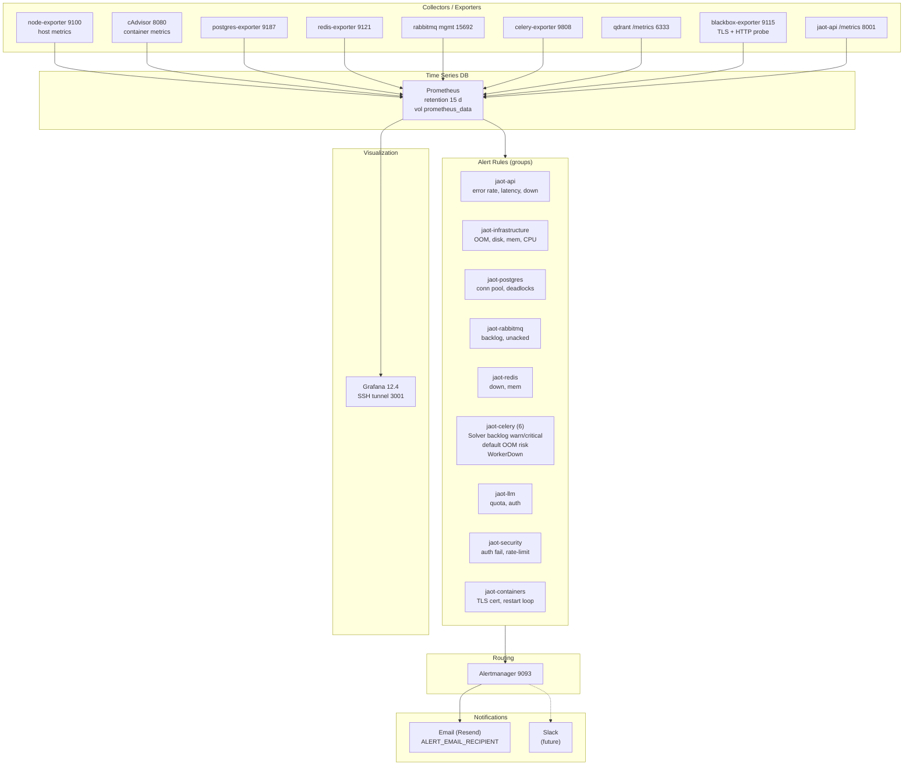

# Monitoring Stack — Prometheus + Grafana + Alertmanager

> Full observability with 9 exporters and ~30 alert rules grouped by domain. Alertmanager routes severity to email (Resend API). Grafana reachable via SSH tunnel on port 3001.

## Diagram

## Grafana Dashboards

| Dashboard | Main panels | Use |
|-----------|---------------------|-----|
| `jaot-overview` | overall status | stack health |
| `solver-workers.json` (Phase 6) | Queue Depth / Solver, Throughput, P95 Duration, Failure Rate, Worker Memory | multi-solver routing post-rotate |

## Alert rules (summary)

| Group | #rules | Key thresholds |
|-------|-------:|-----------------|
| jaot-api | 3 | 5xx > 10 %, P99 > 5 s, down 1 m |
| jaot-infrastructure | 4 | OOM kill, disk < 15 %, mem < 10 %, CPU > 85 % |
| jaot-postgres | 4 | conn > 90 % (crit), > 80 % (warn), deadlocks |
| jaot-rabbitmq | 4 | backlog > 100, down, mem > 85 %, unacked > 50 |
| jaot-redis | 2 | down, mem > 85 % |
| **jaot-celery (Phase 6)** | **6** | exporter down, fail > 10 %, **SolverQueueBacklogWarn > 50 / 5m**, **Critical > 200 / 2m**, DefaultQueueOOMRisk > 90 %, CeleryWorkerDown |
| jaot-qdrant | 1 | down 1 m |
| jaot-llm | 4 | critical quota/auth, upstream error |
| jaot-security | 3 | 401 > 10/s, 429 > 20/s, HTTP endpoint down |
| jaot-containers | 4 | TLS cert < 7 d, restart loop |

## Notes

- **Scrape intervals:** 15 s default, 30 s for the DB/redis/qdrant exporters, 5 m for blackbox (cert checks).
- **Exporters pinned by sha256:** postgres, redis, celery (0.12.2), blackbox. Supply-chain defense.
- **celery-exporter label mismatch:** upstream 0.12.2 emits `queue_name` for task-level metrics but `queue` for `queue_length`. The dashboard follows this convention; alert rules use `queue=~"solve_.*"` (consistent with `queue_length`). A `metric_relabel_config` is an option if task-level alerts are added.
- **Grafana access:** `ssh -L 3001:127.0.0.1:3001 jaot@<SERVER_IP>`. Port 3001 is localhost-only on the server.
- **Retention:** 15 days (`storage.tsdb.retention.time=15d`). For long-term history → export to remote write in the future.
