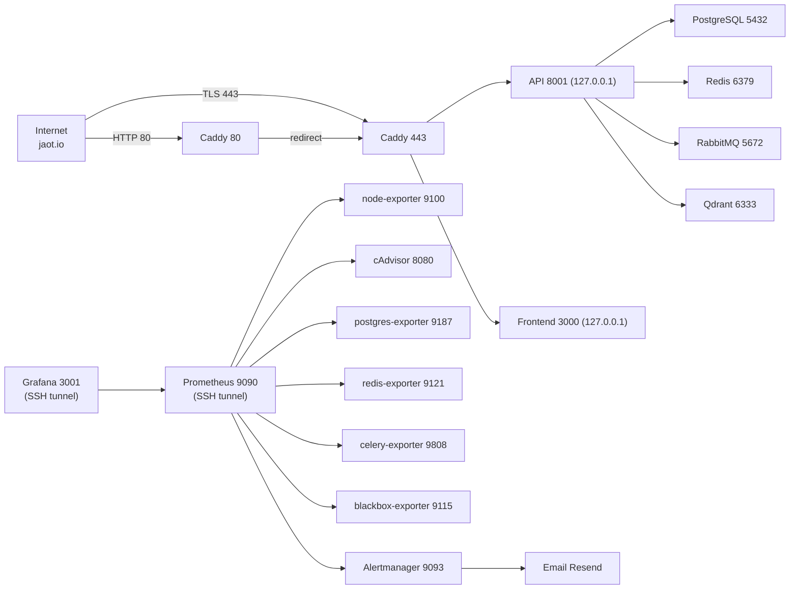

# Network Ports — Exposure and Isolation

> Which service listens on which port, on which network, and whether it is exposed to the internet or internal to the server only.

## Port table

| Service | Port | Network | Binding | Exposed | Notes |
|----------|-------:|-----|---------|----------|-------|
| Caddy HTTP | 80 | frontend | `0.0.0.0:80` | **Internet** | redirects to 443 |
| Caddy HTTPS | 443 | frontend | `0.0.0.0:443` | **Internet** | TLS Let's Encrypt |
| API FastAPI | 8001 | backend | `127.0.0.1:8001` | internal | Caddy proxy `/api/v2/*` |
| Frontend Next.js | 3000 | frontend | `127.0.0.1:3000` | internal | Caddy proxy `/` |
| PostgreSQL | 5432 | backend | `127.0.0.1:5432` | internal | backups via SSH tunnel |
| Redis | 6379 | backend | `127.0.0.1:6379` | internal | rate limit + result backend |
| RabbitMQ AMQP | 5672 | backend | `127.0.0.1:5672` | internal | broker |
| RabbitMQ Management | 15672 | backend | `127.0.0.1:15672` | internal | admin UI (SSH tunnel) |
| Qdrant HTTP | 6333 | backend | `127.0.0.1:6333` | internal | RAG vector DB |
| Prometheus | 9090 | monitoring | `127.0.0.1:9090` | internal | SSH tunnel |
| Grafana | 3001 | monitoring | `127.0.0.1:3001` | internal | SSH tunnel |
| Alertmanager | 9093 | monitoring | `127.0.0.1:9093` | internal | no external access |
| node-exporter | 9100 | monitoring | no bind | internal | scraped by Prometheus |
| cAdvisor | 8080 | monitoring | no bind | internal | scraped |
| postgres-exporter | 9187 | monitoring | no bind | internal | scraped |
| redis-exporter | 9121 | monitoring | no bind | internal | scraped |
| celery-exporter | 9808 | monitoring | no bind | internal | scraped |
| blackbox-exporter | 9115 | monitoring | no bind | internal | TLS + HTTP probes |
| Plausible | 8800 | frontend | `127.0.0.1:8800` | internal | analytics dashboard (SSH tunnel); maps to container port 8000 |
| plausible_db | — | plausible_backend | no bind | internal (isolated) | Plausible postgres 16 |
| plausible_events_db | — | plausible_backend | no bind | internal (isolated) | Plausible ClickHouse 24.12 |

## Flow diagram



## Network security

| Aspect | Implementation | Residual risk |
|---------|----------------|-----------------|
| Internet exposure | Only 80/443 (Caddy) | TLS cert expiry (monitored by blackbox) |
| Service isolation | 4 Docker networks | Docker socket mounted in cAdvisor |
| DB access | bind `127.0.0.1`, no replica | backups require SSH tunnel |
| Admin panels | RabbitMQ / Prometheus / Grafana on `127.0.0.1` | single SSH key is a SPOF |
| UFW firewall | opens 22 / 80 / 443, denies the rest | manual errors in rules |

## SSH tunneling cheat-sheet

```bash
# Grafana
ssh -L 3001:127.0.0.1:3001 jaot@<SERVER_IP>

# RabbitMQ admin
ssh -L 15672:127.0.0.1:15672 jaot@<SERVER_IP>

# Prometheus
ssh -L 9090:127.0.0.1:9090 jaot@<SERVER_IP>
```

## Notes

- **Caddy TLS:** automatic issuance via Let's Encrypt. Requires DNS `jaot.io` → server IP.
- **Exporters without bind:** metrics only reachable from the `monitoring` network.
- **UFW opens 22/80/443:** any new port must go through manual review.
