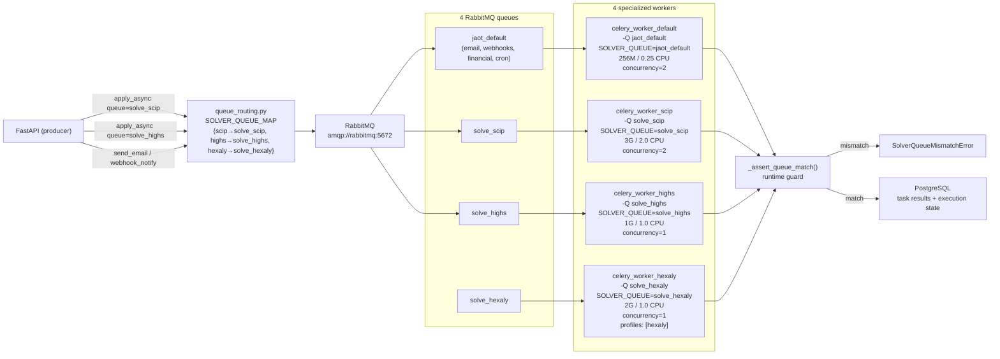

# Celery Queues + Workers — Post-Phase-6

> Single producer (API) · 4 queues in RabbitMQ · 4 specialized workers with a runtime guard (`SOLVER_QUEUE` env var). Hexaly worker is profile-gated (`profiles: ["hexaly"]`).

## Diagram



## Routing — key rules

**Producer** (FastAPI):
1. `resolve_queue(solver_name)` → `"solve_scip"` / `"solve_highs"` / `"solve_hexaly"`.
2. `apply_async(kwargs=..., queue=target_queue)`.
3. If `solver_name` is unknown → `SolverNotFoundError` → HTTP 422 + refund.

**Consumer** (worker container):
1. Starts with `-Q solve_scip` (CLI).
2. Reads `SOLVER_QUEUE=solve_scip` from the env.
3. `_assert_queue_match(solver_name)` compares `SOLVER_QUEUE` against the requested solver.
4. Mismatch → `SolverQueueMismatchError` with a non-leaking message; the task fails immediately (no requeue, since it is deterministic).

## Current routing map

```python
# app/domains/solver/queue_routing.py
SOLVER_QUEUE_MAP = {
    "scip": "solve_scip",
    "highs": "solve_highs",
    "hexaly": "solve_hexaly",  # Active — profile-gated worker in docker-compose.prod.yml
}
```

Hexaly is already wired in the routing map. Activate on a deployment with `--profile hexaly` and a platform license at `/etc/jaot/hexaly.lic`.

## Notes

- **Defense in depth:** routing-level (`-Q`) + runtime guard (`SOLVER_QUEUE` env). Two independent layers.
- **Acks late:** `task_acks_late=True` + `task_reject_on_worker_lost=True` → zero loss on crashes; hung tasks are redelivered.
- **Monitoring:** `celery_queue_length{queue=~"solve_.*"}` feeds the `solver-workers.json` dashboard and the `SolverQueueBacklogWarn/Critical` alerts.
- **Hexaly (D-16, D-17):** active in `SOLVER_QUEUE_MAP`; worker is profile-gated (`profiles: ["hexaly"]`) with 2G memory limit. `SOLVER_QUEUE_MAP` remains the single extension point for future solvers.
