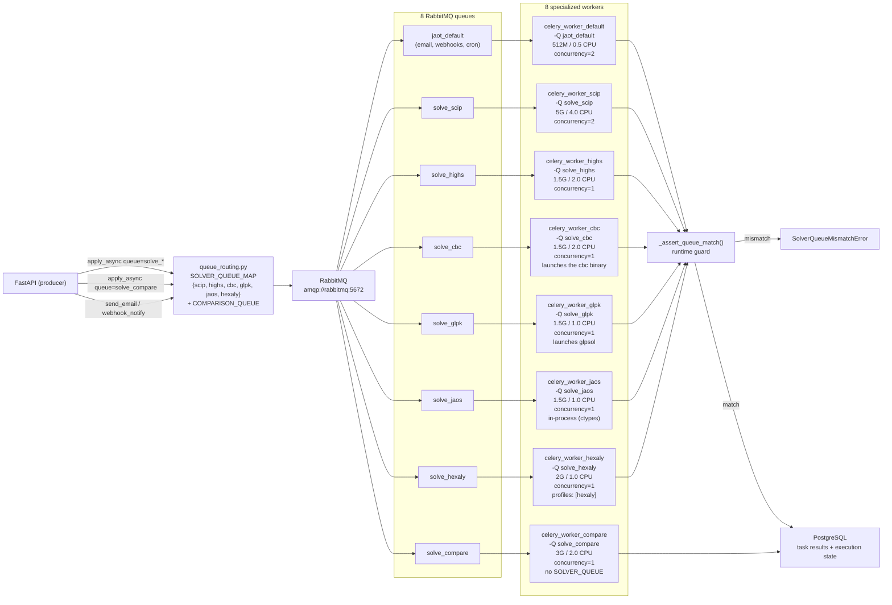

# Celery Queues + Workers

> Single producer (API) · 8 queues in RabbitMQ · 8 specialized workers, seven of them with a runtime guard (`SOLVER_QUEUE` env var). The Hexaly worker is profile-gated (`profiles: ["hexaly"]`); the comparison worker deliberately has no `SOLVER_QUEUE`.

## Diagram


```mermaid
graph LR
    API["FastAPI (producer)"]

    Router["queue_routing.py<br/>SOLVER_QUEUE_MAP<br/>{scip, highs, cbc, glpk, jaos, hexaly}<br/>+ COMPARISON_QUEUE"]

    Broker["RabbitMQ<br/>amqp://rabbitmq:5672"]

    subgraph Queues["8 RabbitMQ queues"]
        DefaultQ["jaot_default<br/>(email, webhooks, cron)"]
        ScipQ["solve_scip"]
        HighsQ["solve_highs"]
        CbcQ["solve_cbc"]
        GlpkQ["solve_glpk"]
        JaosQ["solve_jaos"]
        HexalyQ["solve_hexaly"]
        CompareQ["solve_compare"]
    end

    subgraph Workers["8 specialized workers"]
        DefaultW["celery_worker_default<br/>-Q jaot_default<br/>512M / 0.5 CPU<br/>concurrency=2"]
        ScipW["celery_worker_scip<br/>-Q solve_scip<br/>5G / 4.0 CPU<br/>concurrency=2"]
        HighsW["celery_worker_highs<br/>-Q solve_highs<br/>1.5G / 2.0 CPU<br/>concurrency=1"]
        CbcW["celery_worker_cbc<br/>-Q solve_cbc<br/>1.5G / 2.0 CPU<br/>concurrency=1<br/>launches the cbc binary"]
        GlpkW["celery_worker_glpk<br/>-Q solve_glpk<br/>1.5G / 1.0 CPU<br/>concurrency=1<br/>launches glpsol"]
        JaosW["celery_worker_jaos<br/>-Q solve_jaos<br/>1.5G / 1.0 CPU<br/>concurrency=1<br/>in-process (ctypes)"]
        HexalyW["celery_worker_hexaly<br/>-Q solve_hexaly<br/>2G / 1.0 CPU<br/>concurrency=1<br/>profiles: [hexaly]"]
        CompareW["celery_worker_compare<br/>-Q solve_compare<br/>3G / 2.0 CPU<br/>concurrency=1<br/>no SOLVER_QUEUE"]
    end

    Guard["_assert_queue_match()<br/>runtime guard"]

    DB["PostgreSQL<br/>task results + execution state"]
    Mismatch["SolverQueueMismatchError"]

    API -->|apply_async queue=solve_*| Router
    API -->|apply_async queue=solve_compare| Router
    API -->|send_email / webhook_notify| Router
    Router --> Broker

    Broker --> DefaultQ
    Broker --> ScipQ
    Broker --> HighsQ
    Broker --> CbcQ
    Broker --> GlpkQ
    Broker --> JaosQ
    Broker --> HexalyQ
    Broker --> CompareQ

    DefaultQ --> DefaultW
    ScipQ --> ScipW
    HighsQ --> HighsW
    CbcQ --> CbcW
    GlpkQ --> GlpkW
    JaosQ --> JaosW
    HexalyQ --> HexalyW
    CompareQ --> CompareW

    DefaultW --> Guard
    ScipW --> Guard
    HighsW --> Guard
    CbcW --> Guard
    GlpkW --> Guard
    JaosW --> Guard
    HexalyW --> Guard

    Guard -->|mismatch| Mismatch
    Guard -->|match| DB
    CompareW --> DB
```

## Routing — key rules

**Producer** (FastAPI):
1. `resolve_queue(solver_name)` → the queue that solver's worker consumes.
2. `apply_async(kwargs=..., queue=target_queue)`.
3. If `solver_name` is unknown → `SolverNotFoundError` → HTTP 422.

**Consumer** (worker container):
1. Starts with `-Q solve_scip` (CLI).
2. Reads `SOLVER_QUEUE=solve_scip` from the env.
3. `_assert_queue_match(solver_name)` compares `SOLVER_QUEUE` against the requested solver.
4. Mismatch → `SolverQueueMismatchError` with a non-leaking message; the task fails immediately (no requeue, since it is deterministic).

## Current routing map

```python
# app/domains/solver/queue_routing.py
SOLVER_QUEUE_MAP = {
    "scip": "solve_scip",
    "highs": "solve_highs",
    "cbc": "solve_cbc",
    "glpk": "solve_glpk",
    "jaos": "solve_jaos",
    "hexaly": "solve_hexaly",  # Active — profile-gated worker in docker-compose.prod.yml
}

COMPARISON_QUEUE = "solve_compare"  # not keyed by solver: one task drives several
```

Hexaly is already wired in the routing map. Activate on a deployment with `--profile hexaly` and a platform license at `/etc/jaot/hexaly.lic`.

## Why CBC and GLPK have workers of their own

Both are command-line programs, not Python libraries. A solve launches a child
process and waits for it, so the worker slot is held for the whole run. Sharing
`solve_scip` would let one long GLPK run queue up the SCIP solves behind it, so
the owner decided (2026-08-15) they get a worker each.

The `pids` limit on those two containers has to leave room for the child: a
solve there is always two processes, not one.

JAOS runs inside the worker process through ctypes, so it has no child process.
It still gets a worker of its own (2026-09-24) for the same reason: a slow JAOS
run must not hold a `solve_scip` slot. Automatic routing never sends a solve
there. A user picks JAOS by name or in the comparer.

## Why the comparison worker has no SOLVER_QUEUE

`_assert_queue_match` rejects a task whose solver does not match the worker's
queue. That is right for a single-solver worker and wrong for this one: running
several solvers in one task is its entire job, and no solver maps to
`solve_compare`. It is listed in `SPECIALIZED_QUEUES` instead, which is what
stops the boot-time audit from restart-looping the container.

Its `concurrency=1` is a feature, not a resource choice. The comparison table
puts each solver's seconds next to the others', so only one comparison may be
solving at a time; two at once would be timing two processes sharing a CPU.

## Two kinds of task on `solve_compare`

A solver matrix crosses N datasets with M solvers, and each dataset compiles to
its own problem. `prepare_comparison_row` (in `app/tasks/`, outside the solver
domain because it needs the JModel compiler) does that compiling for one row and
then queues `run_solver_comparison` for it. The launch endpoint writes the rows
and enqueues only the prepares, so nothing waits on a compile inside the request.

Because both land on the same single-slot queue, every row is prepared before
the first one starts solving: the prepares are all enqueued up front, and each
solve joins the queue behind them.

## Pool sizes

The five workers that run one task at a time (`highs`, `cbc`, `glpk`, `jaos`,
`compare`) carry `DB_POOL_SIZE=2` / `DB_MAX_OVERFLOW=2`, not the 5/5 the API and
the two concurrency-2 workers use. Seven always-on Celery containers at ten
connections apiece would put the default profile at about 120, the whole of
`max_connections = 120`.

**The whole budget** (`max_connections = 120`): API 4×10 = 40,
`celery_worker_default` and `celery_worker_scip` 10 each, the five
single-concurrency workers 4 each, beat 10 → **≈ 90 in the worst case**, and
≈ 100 with the Hexaly profile on.

It fits, and it was sized on purpose. Every new worker or queue re-opens the
arithmetic, and it was re-opened twice before JAOS: CBC, GLPK and the
comparison worker took the default profile from four Celery containers to six,
which at the old pool of 10 apiece was ≈ 110 — past the ceiling, where a matrix
launched during a solve would have met `FATAL: sorry, too many clients already`.
The JAOS worker re-opened it on 2026-09-24. It took the worst case from ≈ 86 to
≈ 90, and to ≈ 100 with Hexaly, which is the old ceiling. So `max_connections`
went from 100 to 120. Postgres reads that value only when it starts, and the
deploy does not restart Postgres:
[DEPLOYMENT.md](../../operations/DEPLOYMENT.md#changing-max_connections) has the
one-time restart.

Watch `jaot_db_pool_checked_out / jaot_db_pool_capacity`. If they reach the
ceiling, raise `max_connections` or cut a worker's pool to what its concurrency
can use. Connection pooling in front of Postgres was considered and rejected:
[TECH_DEBT.md](../TECH_DEBT.md#rejected--pgbouncer-in-transaction-mode-was-d-27).

## Notes

- **Defense in depth:** routing-level (`-Q`) + runtime guard (`SOLVER_QUEUE` env). Two independent layers.
- **Acks late:** `task_acks_late=True` + `task_reject_on_worker_lost=True` → zero loss on crashes; hung tasks are redelivered.
- **Monitoring:** `celery_queue_length{queue=~"solve_.*"}` feeds the `solver-workers.json` dashboard and the `SolverQueueBacklogWarn/Critical` alerts.
- **Local dev** runs one monolithic worker consuming `jaot_default,solve_scip,solve_highs,solve_cbc,solve_glpk,solve_jaos`, plus a separate comparison worker that mirrors prod. `tests/integration/test_queue_routing_coherence.py` parses every compose file and fails CI when the producer and the `-Q` flags drift apart.
