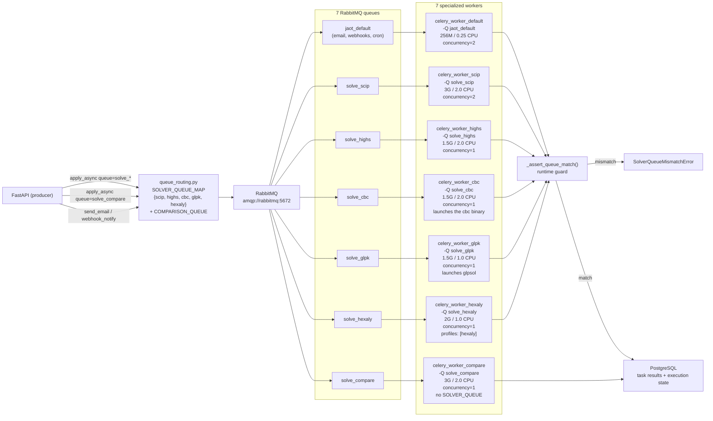

# Celery Queues + Workers

> Single producer (API) · 7 queues in RabbitMQ · 7 specialized workers, six of them with a runtime guard (`SOLVER_QUEUE` env var). The Hexaly worker is profile-gated (`profiles: ["hexaly"]`); the comparison worker deliberately has no `SOLVER_QUEUE`.

## Diagram


```mermaid
graph LR
    API["FastAPI (producer)"]

    Router["queue_routing.py<br/>SOLVER_QUEUE_MAP<br/>{scip, highs, cbc, glpk, hexaly}<br/>+ COMPARISON_QUEUE"]

    Broker["RabbitMQ<br/>amqp://rabbitmq:5672"]

    subgraph Queues["7 RabbitMQ queues"]
        DefaultQ["jaot_default<br/>(email, webhooks, cron)"]
        ScipQ["solve_scip"]
        HighsQ["solve_highs"]
        CbcQ["solve_cbc"]
        GlpkQ["solve_glpk"]
        HexalyQ["solve_hexaly"]
        CompareQ["solve_compare"]
    end

    subgraph Workers["7 specialized workers"]
        DefaultW["celery_worker_default<br/>-Q jaot_default<br/>256M / 0.25 CPU<br/>concurrency=2"]
        ScipW["celery_worker_scip<br/>-Q solve_scip<br/>3G / 2.0 CPU<br/>concurrency=2"]
        HighsW["celery_worker_highs<br/>-Q solve_highs<br/>1.5G / 2.0 CPU<br/>concurrency=1"]
        CbcW["celery_worker_cbc<br/>-Q solve_cbc<br/>1.5G / 2.0 CPU<br/>concurrency=1<br/>launches the cbc binary"]
        GlpkW["celery_worker_glpk<br/>-Q solve_glpk<br/>1.5G / 1.0 CPU<br/>concurrency=1<br/>launches glpsol"]
        HexalyW["celery_worker_hexaly<br/>-Q solve_hexaly<br/>2G / 1.0 CPU<br/>concurrency=1<br/>profiles: [hexaly]"]
        CompareW["celery_worker_compare<br/>-Q solve_compare<br/>3G / 2.0 CPU<br/>concurrency=1<br/>no SOLVER_QUEUE"]
    end

    Guard["_assert_queue_match()<br/>runtime guard"]

    DB["PostgreSQL<br/>task results + execution state"]
    Mismatch["SolverQueueMismatchError"]

    API -->|apply_async queue=solve_*| Router
    API -->|apply_async queue=solve_compare| Router
    API -->|send_email / webhook_notify| Router
    Router --> Broker

    Broker --> DefaultQ
    Broker --> ScipQ
    Broker --> HighsQ
    Broker --> CbcQ
    Broker --> GlpkQ
    Broker --> HexalyQ
    Broker --> CompareQ

    DefaultQ --> DefaultW
    ScipQ --> ScipW
    HighsQ --> HighsW
    CbcQ --> CbcW
    GlpkQ --> GlpkW
    HexalyQ --> HexalyW
    CompareQ --> CompareW

    DefaultW --> Guard
    ScipW --> Guard
    HighsW --> Guard
    CbcW --> Guard
    GlpkW --> Guard
    HexalyW --> Guard

    Guard -->|mismatch| Mismatch
    Guard -->|match| DB
    CompareW --> DB
```

## Routing — key rules

**Producer** (FastAPI):
1. `resolve_queue(solver_name)` → the queue that solver's worker consumes.
2. `apply_async(kwargs=..., queue=target_queue)`.
3. If `solver_name` is unknown → `SolverNotFoundError` → HTTP 422.

**Consumer** (worker container):
1. Starts with `-Q solve_scip` (CLI).
2. Reads `SOLVER_QUEUE=solve_scip` from the env.
3. `_assert_queue_match(solver_name)` compares `SOLVER_QUEUE` against the requested solver.
4. Mismatch → `SolverQueueMismatchError` with a non-leaking message; the task fails immediately (no requeue, since it is deterministic).

## Current routing map

```python
# app/domains/solver/queue_routing.py
SOLVER_QUEUE_MAP = {
    "scip": "solve_scip",
    "highs": "solve_highs",
    "cbc": "solve_cbc",
    "glpk": "solve_glpk",
    "hexaly": "solve_hexaly",  # Active — profile-gated worker in docker-compose.prod.yml
}

COMPARISON_QUEUE = "solve_compare"  # not keyed by solver: one task drives several
```

Hexaly is already wired in the routing map. Activate on a deployment with `--profile hexaly` and a platform license at `/etc/jaot/hexaly.lic`.

## Why CBC and GLPK have workers of their own

Both are command-line programs, not Python libraries. A solve launches a child
process and waits for it, so the worker slot is held for the whole run. Sharing
`solve_scip` would let one long GLPK run queue up the SCIP solves behind it, so
the owner decided (2026-08-15) they get a worker each.

The `pids` limit on those two containers has to leave room for the child: a
solve there is always two processes, not one.

## Why the comparison worker has no SOLVER_QUEUE

`_assert_queue_match` rejects a task whose solver does not match the worker's
queue. That is right for a single-solver worker and wrong for this one: running
several solvers in one task is its entire job, and no solver maps to
`solve_compare`. It is listed in `SPECIALIZED_QUEUES` instead, which is what
stops the boot-time audit from restart-looping the container.

Its `concurrency=1` is a feature, not a resource choice. The comparison table
puts each solver's seconds next to the others', so only one comparison may be
solving at a time; two at once would be timing two processes sharing a CPU.

## Notes

- **Defense in depth:** routing-level (`-Q`) + runtime guard (`SOLVER_QUEUE` env). Two independent layers.
- **Acks late:** `task_acks_late=True` + `task_reject_on_worker_lost=True` → zero loss on crashes; hung tasks are redelivered.
- **Monitoring:** `celery_queue_length{queue=~"solve_.*"}` feeds the `solver-workers.json` dashboard and the `SolverQueueBacklogWarn/Critical` alerts.
- **Local dev** runs one monolithic worker consuming `jaot_default,solve_scip,solve_highs,solve_cbc,solve_glpk`, plus a separate comparison worker that mirrors prod. `tests/integration/test_queue_routing_coherence.py` parses every compose file and fails CI when the producer and the `-Q` flags drift apart.
