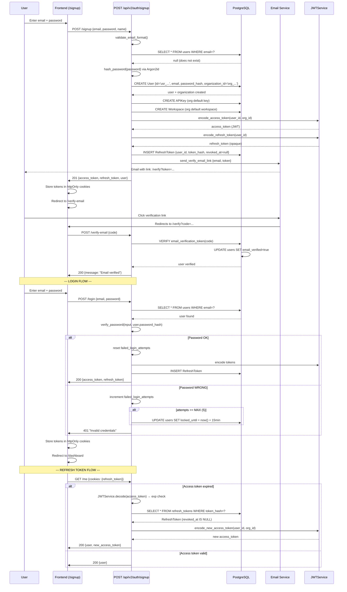

# Use Case: Signup, Email Verification, Login, Token Refresh

> Authentication flow: email signup, verification, login, JWT + refresh tokens.

## Diagram

## Critical Points

### Validation
- **Email format**: RFC 5322 regex
- **Password strength**: minimum 8 characters, complexity (no in-app validation, hash only)
- **Rate limiting**: 5 signup/login per IP per minute (check_rate_limit)

### Security
- **Argon2id**: memory + time params via config (not bcrypt)
- **JWT**: HS256 with JWT_SECRET, exp=1h
- **Refresh tokens**: SHA-256 hash in DB, opaque to the client, never expire (revoke only)
- **Cookies**: httpOnly + Secure (prod), SameSite=Lax
- **Account lockout**: 5 failures → 15 min lock (failed_login_attempts counter)

### Recovery
- If refresh_token revoked (logout): 401 → re-login required
- If refresh_token does not exist: 401 (token expired or invalid)
- Logout: UPDATE refresh_tokens SET revoked_at=now()

## Relevant Files

- `app/api/v2/auth.py:signup()` — signup + org creation + APIKey
- `app/api/v2/auth.py:verify_email()` — consume token, mark verified
- `app/api/v2/auth.py:login()` — authentication + token issuance
- `app/api/v2/auth.py:refresh()` — renew access token
- `app/services/auth/password_service.py:PasswordService` — hash/verify Argon2id
- `app/services/auth/jwt_service.py:JWTService` — encode/decode JWT
- `app/models/user.py:User` — password_hash, email_verified, locked_until
- `app/models/refresh_token.py:RefreshToken` — token_hash, revoked_at
- `app/models/organization.py:Organization` — created at signup
