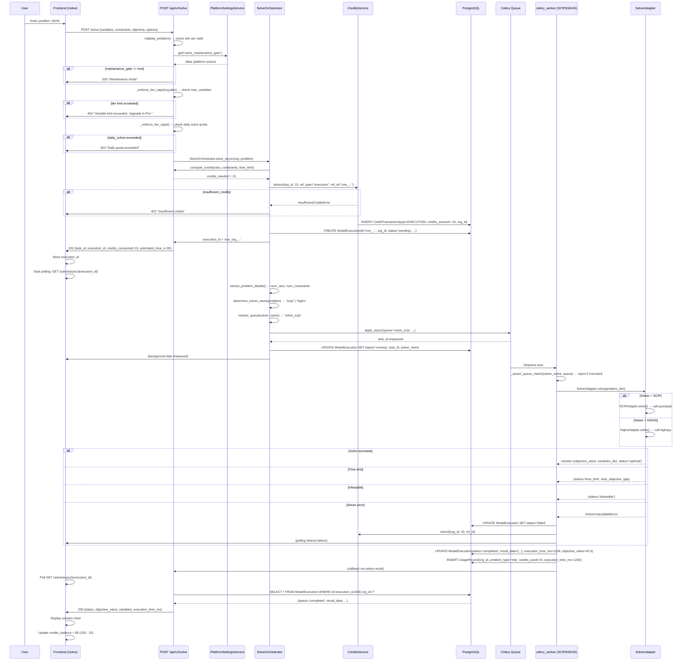

# Use Case: Core Solve Flow — Model Execution

> The flagship flow: user submits a problem, credits are deducted, Celery solves in parallel, the solution is returned.

## Diagram

## Critical Points

### Pre-Solve Validation
1. **`validate_problem()`**: checks variable refs in objective/constraints
2. **`_enforce_tier_caps()`**: validates plan limits (max_variables, max_solves/day)
3. **Maintenance mode**: `solve_maintenance_gate` = true → 503 for everyone

### Pre-Pay + Refund Pattern
1. **Deduct before executing**: `CreditsService.deduct(...)` → CreditTransaction(EXECUTION)
2. **On failure**: `CreditsService.refund(...)` → CreditTransaction(REFUND) with the same reference_id
3. **Idempotency**: Unique constraint prevents double-refund

### Queue Routing per Solver
1. **`resolve_queue(solver_name)`**: maps "scip" → "solve_scip"
2. **Worker `_assert_queue_match()`**: rejects if a task arrives on the wrong queue
3. **Reason**: scalability. SCIP requires more resources than HiGHS

### Timing
- Frontend receives 202 immediately (does not wait for the solve)
- Polling every 2-5 seconds typically
- Client-side timeout: ~5 min
- Solver timeout: via `options.time_limit_seconds` (clamped per plan)

## Relevant Files

- `app/api/v2/solve.py:POST /solve` — main entry point
- `app/api/v2/deps/solve_maintenance_gate.py` — dependency for the gate check
- `app/services/solve_orchestrator.py:SolveOrchestrator` — orchestration
- `app/services/credits_service.py:CreditsService.deduct/refund()` — transactional
- `app/domains/solver/adapters/base.py` — SolverAdapter, DEFAULT_SOLVER_NAME
- `app/domains/solver/adapters/scip_adapter.py` — SCIPAdapter.solve()
- `app/domains/solver/adapters/highs_adapter.py` — HighsAdapter.solve()
- `app/domains/solver/queue_routing.py:resolve_queue()` — queue selection
- `app/tasks/solve_tasks.py` — Celery task (async execution)
- `app/models/optimization_model.py:ModelExecution` — execution record
