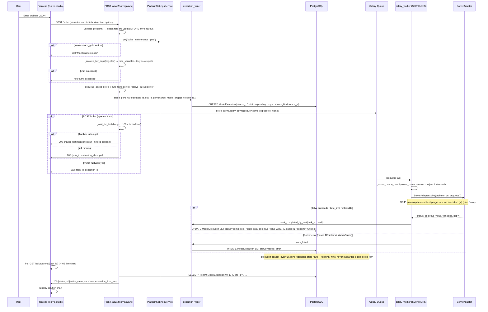

# Use Case: Core Solve Flow — Model Execution

> The flagship flow: user submits a problem, it rides the one async pipeline (ADR-007), Celery solves it, the solution is returned. Free — no credits (ADR-008); fair use = rate limits + quotas + caps.

## Diagram

```mermaid
sequenceDiagram
    participant User as User
    participant Frontend as Frontend (/solve, studio)
    participant API as POST /api/v2/solve[/async]
    participant PSS as PlatformSettingsService
    participant Writer as execution_writer
    participant DB as PostgreSQL
    participant RabbitMQ as Celery Queue
    participant Worker as celery_worker (SCIP|HiGHS)
    participant Solver as SolverAdapter

    User->>Frontend: Enter problem JSON
    Frontend->>API: POST /solve {variables, constraints, objective, options}
    API->>API: validate_problem() → check refs are valid (BEFORE any enqueue)
    API->>PSS: get("solve_maintenance_gate")
    alt maintenance_gate == true
        API->>Frontend: 503 "Maintenance mode"
    end

    API->>API: _enforce_tier_caps(org.plan) → max_variables, daily solve quota
    alt limit exceeded
        API->>Frontend: 403 "Limit exceeded"
    end

    API->>API: _enqueue_async_solve(): auto-route solver, resolve_queue(solver)
    API->>Writer: insert_pending(execution_id, org_id, provenance, model_project_version_id?)
    Writer->>DB: CREATE ModelExecution(id='exe_...', status='pending', origin, source_kind/source_id)
    API->>RabbitMQ: solve_async.apply_async(queue='solve_scip'|'solve_highs')

    alt POST /solve (sync contract)
        API->>API: _wait_for_task(budget ~100s, threadpool)
        alt finished in budget
            API->>Frontend: 200 shaped OptimizationResult (historic contract)
        else still running
            API->>Frontend: 202 {task_id, execution_id} → poll
        end
    else POST /solve/async
        API->>Frontend: 202 {task_id, execution_id}
    end

    RabbitMQ->>Worker: Dequeue task
    Worker->>Worker: _assert_queue_match(solver_name, queue) → reject if mismatch
    Worker->>Solver: SolverAdapter.solve(problem, on_progress?)
    Note over Worker,Solver: SCIP streams per-incumbent progress → ws:execution:{id} (Live Solve)

    alt Solve succeeds / time_limit / infeasible
        Solver-->>Worker: {status, objective_value, variables, gap?}
        Worker->>Writer: mark_completed_by_task(task_id, result)
        Writer->>DB: UPDATE ModelExecution SET status='completed', result_data, objective_value WHERE status IN ('pending','running')
    else Solver error (raised OR internal status='error')
        Worker->>Writer: mark_failed
        Writer->>DB: UPDATE ModelExecution SET status='failed', error
    end

    Note over DB: execution_reaper (every 15 min) reconciles stale rows — terminal-wins, never overwrites a completed row

    Frontend->>Frontend: Poll GET /solve/async/{task_id} (+ WS live chart)
    API->>DB: SELECT * FROM ModelExecution WHERE org_id=? ...
    API->>Frontend: 200 {status, objective_value, variables, execution_time_ms}
    Frontend->>Frontend: Display solution chart
```

## Critical Points

### Pre-Solve Validation
1. **`validate_problem()`**: checks variable refs in objective/constraints — rejects BEFORE enqueue
2. **`_enforce_tier_caps()`**: validates plan limits (max_variables, max_solves/day)
3. **Maintenance mode**: `solve_maintenance_gate` = true → 503 for everyone

### One async pipeline (ADR-007)
1. **Every entry point** (`/solve`, `/solve/async`, template, import, project, multi-objective,
   `execute_model`, triggers) enqueues the same `solve_async` pipeline; sync contracts are thin
   wrappers that wait with a budget and degrade to `202 + task_id`.
2. **Single writer**: `execution_writer` owns every ModelExecution state transition; the atomic
   `UPDATE … WHERE status IN ('pending','running')` makes the worker↔reaper race terminal-wins.
3. **Idempotency**: a duplicate `Idempotency-Key` attaches to the original run (same
   `execution_id`, exactly one row) instead of re-solving.

### Queue Routing per Solver
1. **`resolve_queue(solver_name)`**: maps "scip" → "solve_scip"
2. **Worker `_assert_queue_match()`**: rejects if a task arrives on the wrong queue
3. **Reason**: scalability. SCIP requires more resources than HiGHS

### Timing
- Sync wrappers wait ~100s, then degrade to 202 (the client polls; `request()` in the frontend
  resolves the 202 transparently via `awaitAsyncSolveResult`)
- Polling every 1.5-5 seconds typically; Live Solve chart via WebSocket `ws:execution:{id}`
- Solver timeout: via `options.time_limit_seconds` (clamped per plan)

## Relevant Files

- `app/api/v2/solve.py` — entry points + `_enqueue_async_solve` + sync wrappers/shapers
- `app/domains/solver/tasks/solve_tasks.py:solve_async` — the Celery worker task
- `app/domains/solver/execution_writer.py` — the single ModelExecution writer
- `app/tasks/execution_reaper.py` — stale-row reconciler (terminal-wins)
- `app/domains/solver/adapters/scip.py` / `highs_adapter.py` — SolverAdapter impls
- `app/domains/solver/queue_routing.py:resolve_queue()` — queue selection
- `app/models/optimization_model.py:ModelExecution` — execution record
