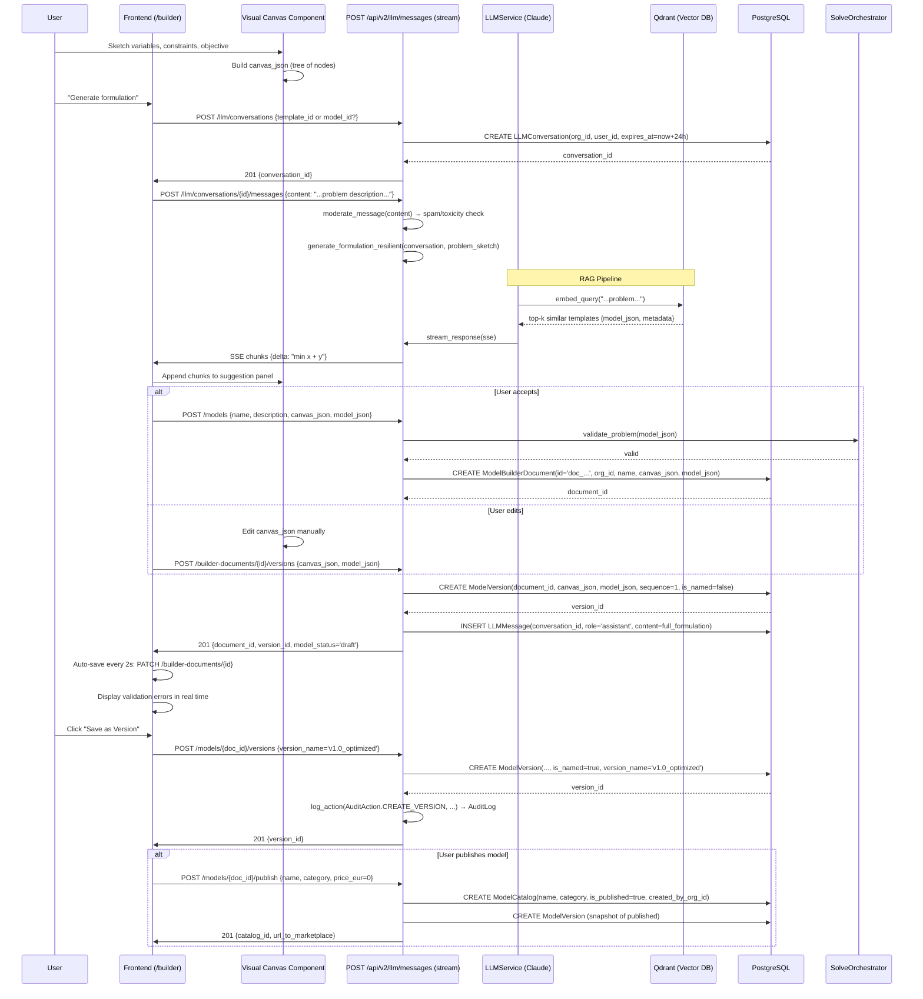

# Use Case: Create Optimization Model — Builder + LLM

> Creation flow: user sketches a model on the canvas, the LLM generates the formulation, saved as ModelBuilderDocument + ModelVersion.

## Diagram

## Critical Points

### Builder Document Lifecycle
1. **Draft**: document created, canvas_json mutable, no ModelVersion yet
2. **Version**: user clicks "Save as Version" → ModelVersion snapshot (immutable)
3. **Published**: sent to ModelCatalog (global), formula locked

### LLM RAG
- **Query embedding**: problem sketch → vector via local `sentence-transformers` (`BAAI/bge-small-en-v1.5`, CPU, 384 dims)
- **Top-k retrieval**: searches Qdrant for similar templates (formulation examples)
- **Prompt engineering**: combines retrieved examples + user sketch → full formulation
- **Streaming**: chunks returned via SSE, frontend renders in real time

### Validation
- **Real-time**: canvas_json is validated against variable refs (constraint refs to vars that don't exist)
- **Pre-save**: model_json passed to SolveOrchestrator.validate_problem()
- **Pre-publish**: full execution test on SCIP/HiGHS mock

### Auto-save
- Frontend auto-saves every 2s: PATCH /builder-documents/{doc_id}
- Server only updates canvas_json, does not create a version
- LLM conversation expires in 24h (configurable)

## Relevant Files

- `app/api/v2/builder.py` — CRUD endpoints for documents
- `app/api/v2/llm.py:POST /llm/conversations/{id}/messages` — stream endpoint
- `app/api/v2/versions.py` — versioning endpoints
- `app/models/builder_document.py:ModelBuilderDocument`
- `app/models/model_version.py:ModelVersion`
- `app/models/optimization_model.py:ModelCatalog`
- `app/services/llm/formulation_service.py:generate_formulation_resilient()`
- `app/services/llm/prompt_templates.py` — RAG + LLM prompts
- `app/services/solve_orchestrator.py:validate_problem()`
