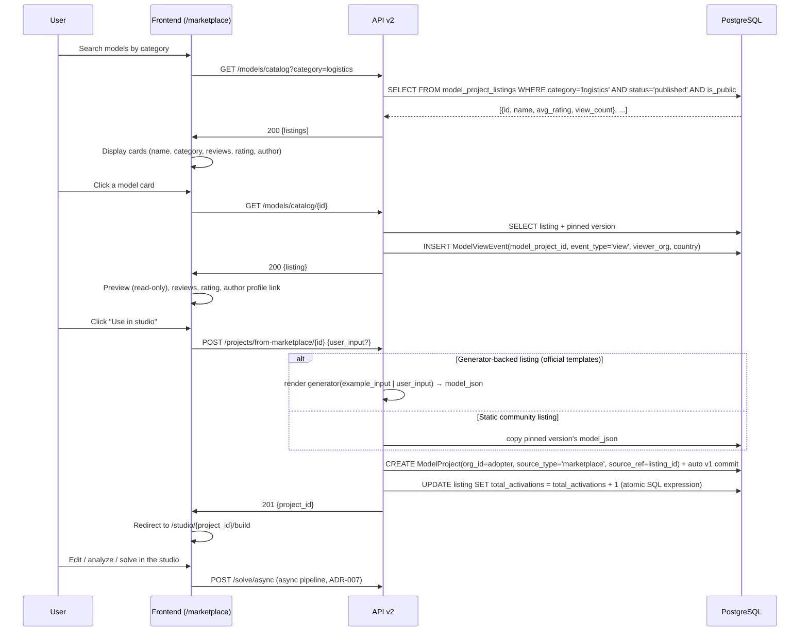

# Use Case: Marketplace Adoption — "Use in studio"

> Acquisition flow: user browses the marketplace, previews a model, and forks it into their own
> studio as an editable, versioned `ModelProject`.

> **Note (ADR-008, 2026-07-10):** the marketplace is **free and collaborative**. The former paid
> purchase flow (Stripe checkout, commission split, seller payouts, credit ledger) was removed
> entirely — adopting a model costs nothing, always.

> **Note (P1.5 fusion, 2026-07-13):** the legacy "Activate model" flow (which created an
> `OrganizationModel` join row) was collapsed by the ModelProject unification (ADR-006). There is
> now exactly ONE acquisition path: **"Use in studio"**, which materializes the listing into a
> first-class `ModelProject` owned by the adopting org. The marketplace itself is a *facet*:
> `ModelProjectListing` is a 1:1 companion row on the author's `ModelProject`.

## Diagram

## Critical Points

### No payment layer
- Adoption is free by design (ADR-008); there is no price, no commission, no ledger entry.
- Fair use is enforced elsewhere: rate limits, daily solve quota, per-solve time/size caps.

### Access Control
- The fork is a normal org-scoped `ModelProject` — the adopting org owns its copy outright
  (multi-tenancy filter `organization_id`, same as any other project).
- The author's original project and listing are never touched by adopters.

### Analytics (non-monetary)
- **ModelViewEvent**: records impressions + views per listing (`model_project_id`).
- **Author analytics**: views, impressions, and *adoption* (forks by other orgs) of your
  published models (`AuthorAnalyticsService`; forking your own model never counts).
- **Ratings**: `ModelReview` keyed on `model_project_id`; the average is rolled up onto the
  listing. Anti-spam gate: only orgs that forked the model AND completed an execution can review.

## Relevant Files

- `app/api/v2/routes/models/catalog.py` — browse/detail/schema over `ModelProjectListing`
- `app/api/v2/projects.py:POST /projects/from-marketplace/{id}` — the single adoption path
- `app/services/template_resolver.py` — resolves generator-backed vs static listings
- `app/services/author_analytics_service.py` — non-monetary author analytics
- `app/models/model_project.py:ModelProject, ModelProjectListing`
- `app/models/model_view_event.py:ModelViewEvent` — analytics
