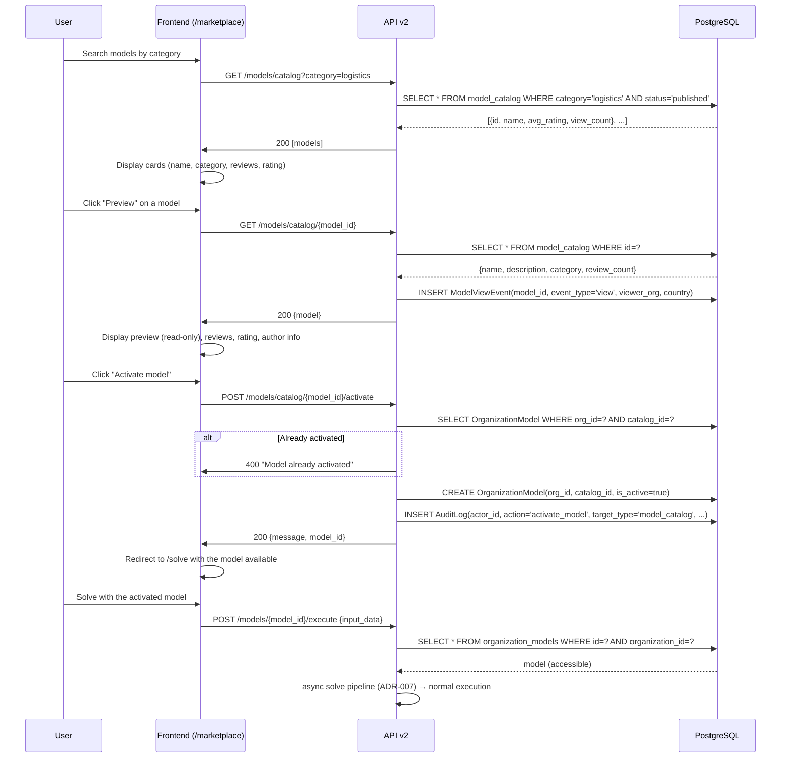

# Use Case: Marketplace Activation — Model Acquisition

> Acquisition flow: user browses the catalog, previews a model, activates it for free, and solves with it.

> **Note (ADR-008, 2026-07-10):** the marketplace is **free and collaborative**. The former paid
> purchase flow (Stripe checkout, commission split, seller payouts, credit ledger) was removed
> entirely — activation costs nothing, always. This document describes the current flow.

## Diagram

There is also a second, newer acquisition path: **"Use in studio"** materializes the catalog model
into a first-class `ModelProject` (editable + versioned) via `POST /projects/from-marketplace/{id}`,
instead of activating it as a parametric `OrganizationModel`.

## Critical Points

### No payment layer
- Activation is free by design (ADR-008); there is no price, no commission, no ledger entry.
- Fair use is enforced elsewhere: rate limits, daily solve quota, per-solve time/size caps.

### Access Control
- **OrganizationModel**: join table that explicitly grants access to the activating org
- **Without access**: the query fails `WHERE organization_id=? AND model_id=?` → 404
- **Solve execution**: always filtered by org_id

### Analytics (non-monetary)
- **ModelViewEvent**: records impressions + views per model
- **Seller analytics**: views, impressions, activations of your published models
  (`SellerAnalyticsService`; a foreign org activating its own model never counts for you)
- **Ratings**: ModelReview (measures model quality, drives catalog `min_rating` filter)

## Relevant Files

- `app/api/v2/routes/models/catalog.py:POST /models/catalog/{model_id}/activate` — activation
- `app/api/v2/projects.py:POST /projects/from-marketplace/{id}` — materialize into the studio
- `app/services/seller_analytics_service.py` — non-monetary seller analytics
- `app/models/optimization_model.py:ModelCatalog, OrganizationModel`
- `app/models/model_view_event.py:ModelViewEvent` — analytics
