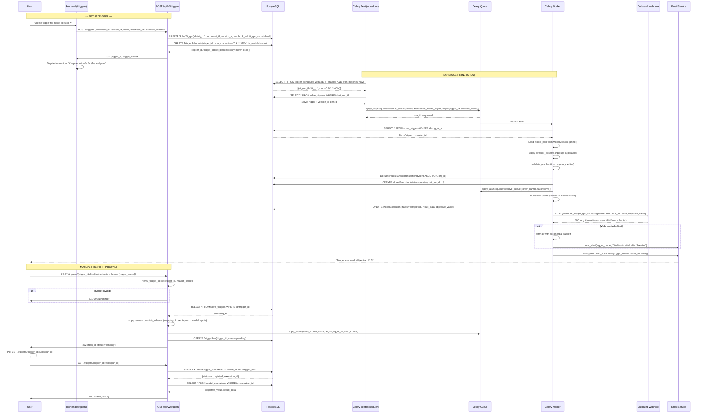

# Use Case: Automation via Triggers — Schedule + Webhook

> Automation flow: cron or inbound HTTP trigger → launches async solve → notifies the result.

## Diagram

## Critical Points

### Schedule (Cron)
1. **Celery Beat**: daemon that reads the `trigger_schedules` table every minute
2. **Cron expression**: standard (0 9 * * MON = 9 AM Mondays)
3. **Timezone**: always UTC (configurable via PSS)
4. **Last run tracking**: `last_run_at` to prevent duplicates if Beat restarts

### Manual Fire (/fire)
1. **Public endpoint**: does not require API key auth (separate trigger secret)
2. **Secret verification**: SHA-256 hash vs header `Authorization: Bearer {secret}`
3. **Rate limiting**: `trigger_id` → max 10/min (configurable)
4. **Override schema**: simplified input mapping (e.g. {qty: 100} → {num_items: 100})

### Webhook Outbound
1. **Signing**: HMAC-SHA256(webhook_secret, payload) in the `X-Trigger-Signature` header
2. **Retry**: 3x with backoff (1s, 2s, 4s)
3. **Timeout**: 30s per attempt
4. **Destination**: any URL (N8N, Zapier, custom endpoint)

### Credits
- **Pre-deduct**: same pattern as manual solve
- **Refund on failure**: if the execution fails, automatic refund
- **Rate limiting**: the `daily_solves` limit still applies

## Relevant Files

- `app/api/v2/triggers.py:POST /triggers/fire` — manual fire endpoint
- `app/models/trigger.py:SolveTrigger, TriggerRun, TriggerSchedule`
- `app/tasks/trigger_tasks.py` — Celery beat task definition
- `app/services/trigger_service.py` — business logic (fire, validate, etc.)
- `app/shared/core/celery_app.py` — Celery config + Beat schedule (`beat_schedule` dict)
- `app/core/prometheus_metrics.py` — trigger execution counters
