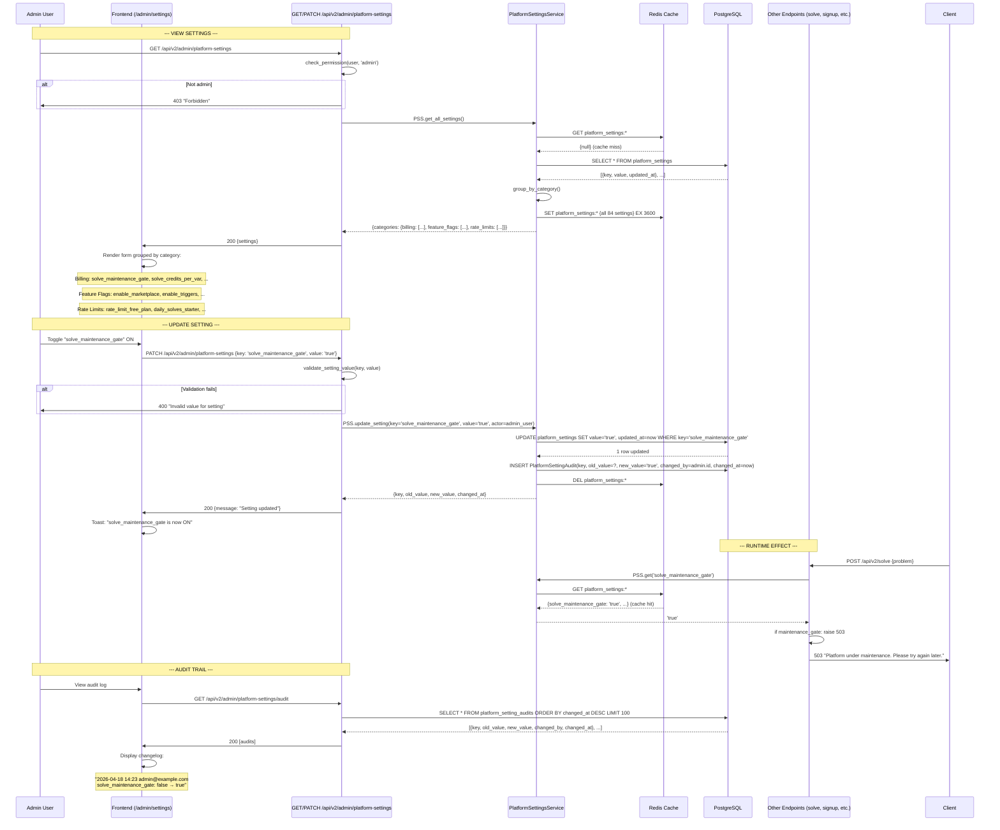

# Use Case: Admin Platform Settings — Global Configuration

> Administration flow: admin modifies 84 global settings → cache invalidation → runtime effect for everyone.

## Diagram

## Critical Points

### 84 Settings Categories

| Category | Examples | Type |
|---|---|---|
| **Billing** | solve_credits_per_var, max_credits_per_solve, chargeback_threshold | int/float |
| **Feature Flags** | enable_marketplace, enable_triggers, enable_seller_analytics | bool |
| **Rate Limits** | max_daily_solves_free, max_api_calls_per_minute_starter | int |
| **Solver** | solve_maintenance_gate, scip_enabled, highs_enabled, default_solver | bool/string |
| **LLM** | llm_model_name, llm_temperature, rag_top_k | string/int |
| **Marketplace** | marketplace_commission_percentage, featured_placement_price_eur | float |
| **Notifications** | notification_batch_interval_minutes, email_enabled | int/bool |

### Cache Invalidation
1. **Read**: fetch from Redis (cache-aside pattern)
2. **Write**: DELETE key + re-populate on next read
3. **TTL**: 1 hour (configurable)
4. **Fallback**: DB query on cache miss

### Audit Trail
- **PlatformSettingAudit**: immutable log entry per update
- **Full history**: traceable to actor + timestamp
- **Rollback**: manual (admin resets value), no auto-rollback

### Permission Check
- **Only admins** (User.is_admin = true) can modify
- **Endpoint**: `/api/v2/admin/platform-settings` in routes/admin/
- **Rate limiting**: extra strict (1 req/sec per admin)

## Relevant Files

- `app/api/v2/routes/admin/settings.py` — CRUD endpoint
- `app/services/platform_settings_service.py:PlatformSettingsService` — cache + audit
- `app/models/platform_setting.py:PlatformSetting`
- `app/models/platform_setting_audit.py:PlatformSettingAudit`
- `app/services/settings_registry.py` — registers defaults at startup
- `app/config.py` — non-configurable infrastructure (DB URL, Redis, etc.)
