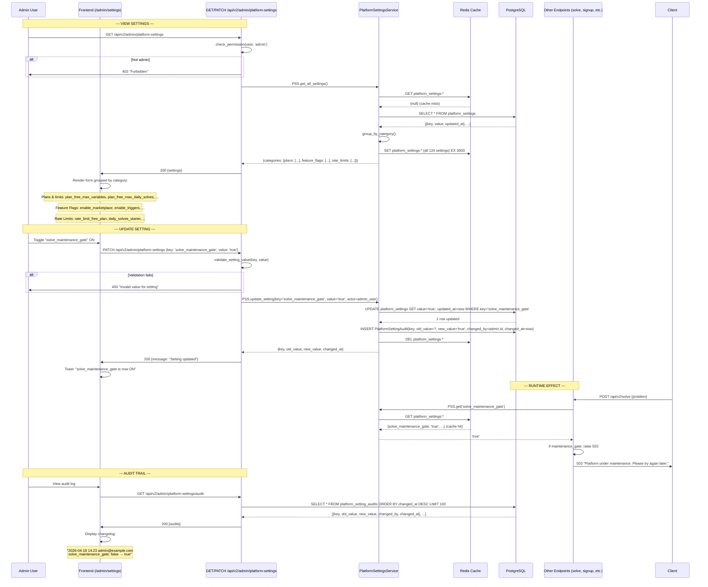

# Use Case: Admin Platform Settings — Global Configuration

> Administration flow: admin modifies 84 global settings → cache invalidation → runtime effect for everyone.

## Diagram

```mermaid
sequenceDiagram
    participant Admin as Admin User
    participant Frontend as Frontend (/admin/settings)
    participant API as GET/PATCH /api/v2/admin/platform-settings
    participant PSS as PlatformSettingsService
    participant Cache as Redis Cache
    participant DB as PostgreSQL
    participant APIEndpoints as Other Endpoints (solve, signup, etc.)
    
    note over Admin,API: --- VIEW SETTINGS ---
    Admin->>API: GET /api/v2/admin/platform-settings
    API->>API: check_permission(user, 'admin')
    alt Not admin
        API->>Admin: 403 "Forbidden"
    end
    
    API->>PSS: PSS.get_all_settings()
    PSS->>Cache: GET platform_settings:*
    Cache-->>PSS: {null} (cache miss)
    PSS->>DB: SELECT * FROM platform_settings
    DB-->>PSS: [{key, value, updated_at}, ...]
    PSS->>PSS: group_by_category()
    PSS->>Cache: SET platform_settings:* {all 124 settings} EX 3600
    PSS-->>API: {categories: {plans: [...], feature_flags: [...], rate_limits: [...]}}
    
    API->>Frontend: 200 {settings}
    Frontend->>Frontend: Render form grouped by category:
    note over Frontend: Plans & limits: plan_free_max_variables, plan_free_max_daily_solves, ...
    note over Frontend: Feature Flags: enable_marketplace, enable_triggers, ...
    note over Frontend: Rate Limits: rate_limit_free_plan, daily_solves_starter, ...
    
    note over Admin,API: --- UPDATE SETTING ---
    Admin->>Frontend: Toggle "solve_maintenance_gate" ON
    Frontend->>API: PATCH /api/v2/admin/platform-settings {key: 'solve_maintenance_gate', value: 'true'}
    
    API->>API: validate_setting_value(key, value)
    alt Validation fails
        API->>Admin: 400 "Invalid value for setting"
    end
    
    API->>PSS: PSS.update_setting(key='solve_maintenance_gate', value='true', actor=admin_user)
    PSS->>DB: UPDATE platform_settings SET value='true', updated_at=now WHERE key='solve_maintenance_gate'
    DB-->>PSS: 1 row updated
    
    PSS->>DB: INSERT PlatformSettingAudit(key, old_value=?, new_value='true', changed_by=admin.id, changed_at=now)
    PSS->>Cache: DEL platform_settings:*
    PSS-->>API: {key, old_value, new_value, changed_at}
    
    API->>Frontend: 200 {message: "Setting updated"}
    Frontend->>Frontend: Toast: "solve_maintenance_gate is now ON"
    
    note over APIEndpoints,DB: --- RUNTIME EFFECT ---
    Client->>APIEndpoints: POST /api/v2/solve {problem}
    APIEndpoints->>PSS: PSS.get('solve_maintenance_gate')
    PSS->>Cache: GET platform_settings:*
    Cache-->>PSS: {solve_maintenance_gate: 'true', ...} (cache hit)
    PSS-->>APIEndpoints: 'true'
    
    APIEndpoints->>APIEndpoints: if maintenance_gate: raise 503
    APIEndpoints->>Client: 503 "Platform under maintenance. Please try again later."
    
    note over Admin,API: --- AUDIT TRAIL ---
    Admin->>Frontend: View audit log
    Frontend->>API: GET /api/v2/admin/platform-settings/audit
    API->>DB: SELECT * FROM platform_setting_audits ORDER BY changed_at DESC LIMIT 100
    DB-->>API: [{key, old_value, new_value, changed_by, changed_at}, ...]
    API->>Frontend: 200 [audits]
    Frontend->>Frontend: Display changelog:
    note over Frontend: "2026-04-18 14:23 admin@example.com<br/>solve_maintenance_gate: false → true"
```

## Critical Points

### Settings Categories (~85 entries; source of truth = `app/services/settings_registry.py`)

| Category | Examples | Type |
|---|---|---|
| **System / feature flags** | MAINTENANCE_MODE, SOLVE_MAINTENANCE_MODE, JAOT_DSL, REGISTRATION_ENABLED | bool |
| **Plans & limits** | max_daily_solves, max_variables (per plan tier) | int/float |
| **Rate limits** | AUTH_LOGIN_RATE_LIMIT_PER_MINUTE, LLM_RATE_LIMIT_PER_DAY | int |
| **Solver** | SOLVER_DEFAULT_TIMEOUT, SOLVER_POOL_SIZE, dsl_max_grounded_elements | int/float |

> **Every capacity limit accepts 0, which means unlimited** — plan limits, per-plan rate
> limits, and the JModel grounding budget alike. None of them has an upper bound in the
> panel either: this is self-hosted software, and an operator with large hardware must be
> able to type any number. A rate limit of 0 allows all requests; it does *not* mean "no
> requests allowed".
| **LLM / RAG** | LLM_DEFAULT_MODEL, LLM_MONTHLY_BUDGET_EUR, RAG_ENABLED, RAG_TOP_K | string/int/bool |
| **Email / SMTP** | EMAIL_BACKEND, SMTP_HOST, EMAIL_FROM | string |

### Cache Invalidation
1. **Read**: fetch from Redis (cache-aside pattern)
2. **Write**: DELETE key + re-populate on next read
3. **TTL**: 1 hour (configurable)
4. **Fallback**: DB query on cache miss

### Audit Trail
- **PlatformSettingAudit**: immutable log entry per update
- **Full history**: traceable to actor + timestamp
- **Rollback**: manual (admin resets value), no auto-rollback

### Permission Check
- **Only admins** (User.is_admin = true) can modify
- **Endpoint**: `/api/v2/admin/platform-settings` in routes/admin/
- **Rate limiting**: extra strict (1 req/sec per admin)

## Relevant Files

- `app/api/v2/routes/admin/settings.py` — CRUD endpoint
- `app/services/platform_settings_service.py:PlatformSettingsService` — cache + audit
- `app/models/platform_setting.py:PlatformSetting`
- `app/models/platform_setting_audit.py:PlatformSettingAudit`
- `app/services/settings_registry.py` — registers defaults at startup
- `app/config.py` — non-configurable infrastructure (DB URL, Redis, etc.)
