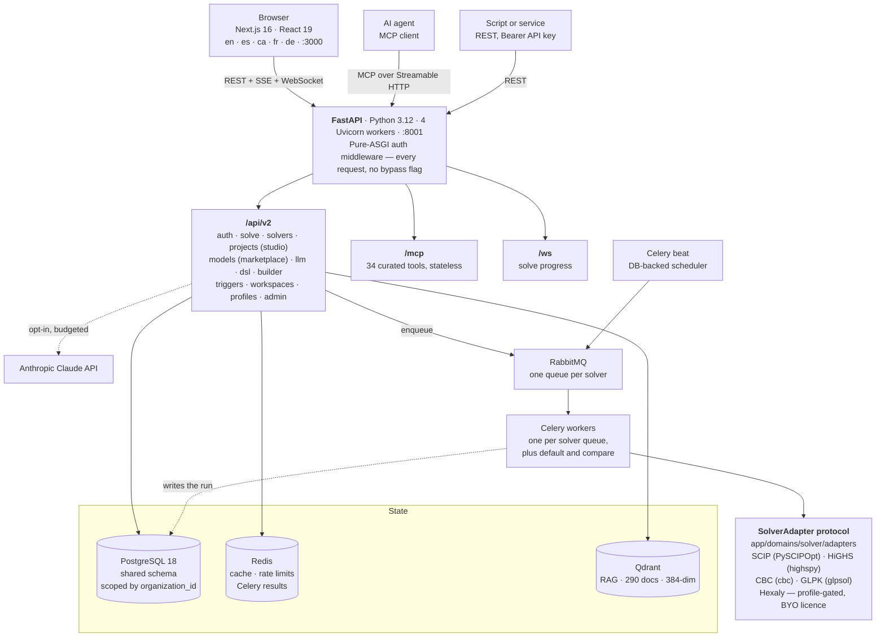

# Architecture Overview — JAOT

> **Updated:** August 2026
> **Architecture:** Modular Monolith (see [Architecture Decision Records](#architecture-decision-records) below)

## Overview

JAOT is a multi-tenant optimization platform. Users build, share, and automate optimization models through the REST API, the model studio, the MCP server, or the AI assistant. It deploys as a single process against a single database. Two bounded contexts have been extracted so far (`app/domains/solver/` and `app/domains/dsl/`); the rest still lives in flat `app/services/` and moves phase by phase.

## API Structure

Every router is registered in `app/api/v2/router.py`. Most declare their own path
prefix; a few do not, so the router name and the URL differ. The table lists the
URL, because that is what a client calls.

| Path under `/api/v2/` | Router module | What it serves |
|---|---|---|
| `auth/` | `auth.py` | Email signup/login, JWT, refresh, password reset |
| `solve/` | `solve.py` + solver domain | Direct solve, templates, file import/export, insights, analytics |
| `solvers/` | `solvers.py` | Available solvers and their capabilities |
| `solvers/compare/` | `solver_comparison.py`, `solver_comparison_batch.py` | One problem across several solvers, and the dataset × solver matrix |
| `models/` | `routes/models/` | Marketplace catalog (listings), executions, favorites, media |
| `projects/` | `projects.py` | ModelProject (studio): versions, stats, datasets, solve, publish, from-template / from-marketplace |
| `llm/` | `llm.py` | AI formulation assistant (SSE streaming) |
| `dsl/` | `dsl.py` | JModel compile, derive, mathematical-notation view |
| `builder/` | `builder.py`, `versions.py` | Visual model builder documents and their versions (`builder/{id}/versions`) |
| `triggers/` | `triggers.py`, `schedules.py` | Automated solve triggers, and the cron schedule attached to each (`triggers/{id}/schedule`) |
| `schedules/validate` | `schedules.py` | Validate a cron expression |
| `author/` | `author.py` | Author analytics (views, adoption of published models) |
| `keys/` | `keys.py` | API key management |
| `notifications/` | `notifications.py` | In-app notifications + preferences |
| `workspaces/` | `routes/workspaces/` | Workspaces, members, invites, audit |
| `users/`, `organizations/` | `routes/profiles/` | Public user and org profiles, and model reviews |
| `organization/` | `org_settings.py` | Per-organization settings |
| `user/` | `gdpr.py` | Data export, account deletion |
| `guidance` | `guidance.py` | In-app guidance content |
| `feedback/` | `feedback.py` | Product feedback |
| `community/` | `community.py` | Community links and status |
| `contact/` | `contact.py` | Public contact form |
| `home/` | `home.py` | Public landing-page data |
| `admin/` | `routes/admin/` | Users, orgs, models, settings, analytics, marketplace, scorecard |
| `health/` | `health.py` | `health/status` is the endpoint monitoring and the container healthcheck probe |
| `ws/` | `ws.py` | WebSocket, solve progress streaming |

Three surfaces sit **outside** `/api/v2/`, mounted at the application root:

| Path | Module | What it is |
|---|---|---|
| `/mcp` | `app/mcp/` | MCP server, Streamable HTTP, forced stateless so any Uvicorn worker can answer. 34 tools, generated from the FastAPI operations listed in `app/mcp/__init__.py` |
| `/metrics` | `app/main.py` | Prometheus scrape endpoint |
| `/.well-known/llms.txt`, `/.well-known/llms-full.txt` | `llms.py` | Machine-readable description of the platform for AI agents |

## Key Pages (Frontend)

| Route | Purpose |
|---|---|
| `/studio` | My Models — every model is a versioned `ModelProject` |
| `/studio/new` | Launcher: canvas, AI assistant, JSON editor, import, template, marketplace |
| `/studio/templates` | Template gallery (seeds a project from a curated template) |
| `/studio/{id}/build` | Workspace — Build tab (Canvas / Assistant / Editor / JModel lenses) |
| `/studio/{id}/analyze` | Workspace — Analyze tab (stats, health, explain, I/O, publish entry) |
| `/studio/{id}/solve` | Workspace — Solve tab (async solve, live progress, per-project history) |
| `/studio/{id}/publish` | Publish a committed version to the marketplace |
| `/solve` | Redirects to `/studio` (legacy "Activated Models" collapsed by the P1.5 fusion) |
| `/solve/executions` | Global execution history (all models, org-wide) |
| `/solve/executions/compare` | Side-by-side comparison of two executions |
| `/solve/compare` | Solver comparer — one problem, several solvers, one machine, one at a time |
| `/solve/analytics` | Solve analytics dashboard |
| `/solve/favorites` | Favorite marketplace models |
| `/solve/import` | File import (MPS/LP/CIP/JSON) |
| `/solve/multi-objective` | Multi-objective optimization |
| `/builder` | Visual model builder (canvas substrate) |
| `/builder/ai-assistant` | AI formulation assistant |
| `/builder/templates` | Template gallery |
| `/marketplace` | Model marketplace (listings; one action: "Use in studio") |
| `/marketplace/{modelId}` | Marketplace listing detail and reviews |
| `/marketplace/authors/{orgId}` | Public author profile |
| `/docs` | User documentation, MDX, served by the frontend |
| `/triggers` | Automated triggers |
| `/workspace` | Dashboard, API keys, settings |
| `/admin` | Admin panel |

## Authentication

- **API Keys**: Prefixed (`ok_live_`, `ok_test_`), SHA-256 hashed, per-organization
- **JWT**: Email/password login with access + refresh tokens (HttpOnly cookies)
- **Auth Middleware**: Pure ASGI middleware (not BaseHTTPMiddleware), validates every request
- **Auth is always enabled** — no bypass flag. Every endpoint protected unless in `PUBLIC_PATHS`

## Multi-Tenancy

Shared database with `organization_id` column scoping. Every query filtered by `org.id` via `CurrentOrg` dependency injection.

## Solver

Solver-agnostic abstraction via **SolverAdapter Protocol** (shipped Phase 4, v2.2). Currently ships SCIP (via PySCIPOpt), HiGHS (via highspy), and CBC and GLPK as command-line programs the adapter runs as separate processes, plus an optional Hexaly adapter (proprietary SDK, bring-your-own-license). New solvers are added by implementing a single adapter behind the protocol.

Architecture (`app/domains/solver/`):
- **`adapters/base.py`** — the `SolverAdapter` Protocol. Its surface is `capabilities`, `is_available()`, `version()` and `solve()`. `validate_license` was removed in Phase 7.4 (D-10): Hexaly's licence is a platform concern, not an adapter one. Also here: the `SolverCapabilities` frozen dataclass (9 fields), the exception hierarchy (`SolverError`, `SolverNotFoundError`, `SolverUnavailableError`), and the `MultiObjectiveSolverAdapter` extension a solver opts into
- **`adapters/registry.py`** — `SolverRegistry` singleton (`register`, `get`, `list_available`, `reset`). Names normalized with `.lower()`
- **`adapters/scip.py`** — `SCIPAdapter` owns the whole SCIP pipeline: configure, build variables and constraints, set the objective, apply a warm start, solve, then extract the result and the sensitivity data
- **`adapters/_scip_expression.py`**, **`_scip_import.py`**, **`_scip_model_builder.py`** — private helpers with lazy pyscipopt imports
- **`services/solver_service.py`** — a thin solver-agnostic orchestrator. It dispatches through `registry.get(solver_name).solve()`. The multi-objective loops (`_solve_weighted`, `_solve_epsilon_constraint`) build fresh `OptimizationProblem` subproblems and call `adapter.solve()`; they never touch a solver API directly
- **`services/model_builder.py`**, **`services/file_import.py`** — `sys.modules` shims that redirect to the adapter-side helpers, so importers written before the extraction still work
- **Bootstrap**: `register_default_adapters()` runs from `create_app()` before route registration. There is no decorator auto-registration — the list is explicit, for supply-chain safety (ADR D-09)

Supporting components:
- **32 problem generators** in `app/domains/solver/services/generators/`, plus a generic passthrough — produce solver-agnostic `OptimizationProblem`. The registry holds 36 names because `scheduling`/`employee_scheduling`, `routing`/`vehicle_routing` and `blending`/`fertilizer` are aliases of one class each. 31 are reached by a template today; the rest are reachable by name from the API
- **Expression parser** (`app/domains/solver/services/expression_parser.py`) — recursive descent, produces `ParsedExpression` IR. Imports without pyscipopt (TD-3 closed in Phase 4)
- **Template engine** — dispatches to generators based on template category
- **Async solve pipeline** (ADR-007) — every entry point enqueues the same `solve_async` Celery task; `execution_writer` is the single ModelExecution writer (the `solve_orchestrator.py` module survives only as a helper home: `validate_problem`, `ExecutionSource`, warm-start loading)
- **File import/export** — MPS, LP, CIP, JSON upload; MPS, LP, CIP, SOL, CSV, JSON download

The import boundary is the `solver-services-no-pyscipopt` contract in `pyproject.toml` `[tool.importlinter]`: any `from pyscipopt` outside `app/domains/solver/adapters/` breaks it. All 7 contracts are currently KEPT. They run twice — as a pre-commit hook and as a step in the `lint-backend` CI job — because a hook can be skipped with `--no-verify`. `lint-imports` needs no application dependencies: it parses the source instead of importing it.

## Async Tasks (Celery)

Broker: RabbitMQ. Result backend: Redis. The authoritative list is the `include=[]`
block in `app/shared/core/celery_app.py` — a module missing from it is never
registered, so keep the two in step.

| Module | What it does |
|---|---|
| `app.domains.solver.tasks.solve_tasks` | Async solver execution. Every entry point funnels here (ADR-007) |
| `app.domains.solver.tasks.scenario_tasks` | Sensitivity L2 — the what-if batch of real re-solves |
| `app.domains.solver.tasks.comparison_tasks` | Solver comparison: one problem, N solvers |
| `app.tasks.comparison_prepare` | Compiles one row of the dataset × solver matrix. It lives outside the solver domain because it needs the JModel compiler, which a solver-domain module may not import |
| `app.tasks.trigger_tasks` | Triggered solve execution |
| `app.tasks.email_tasks` | Onboarding email sequence |
| `app.tasks.webhook_tasks` | Outbound webhook delivery |
| `app.tasks.contact_tasks` | Public contact-form SMTP delivery |
| `app.tasks.cron_tasks` | Periodic cleanup |
| `app.tasks.execution_reaper` | Sweeps stale async executions and refunds their quota |
| `app.tasks.hexaly_platform_license_expiry` | Hexaly platform-licence expiry sweep |
| `app.tasks.solver_ports` | Not a task module. Importing it registers the host-side implementations of the solver domain's ports (D-16). This entry is the worker's registration point — drop it and every solve fails at its first port use |

Beat is DB-backed (`sqlalchemy_celery_beat.schedulers:DatabaseScheduler`), so
schedules survive a restart and are editable at runtime.

## Architecture Decision Records

Key architecture decisions (full ADRs in [08-decisions/](./08-decisions/README.md)):

| Decision | Summary | Status |
|---|---|---|
| SCIP as default solver | PySCIPOpt, evolving to multi-solver | Accepted |
| RabbitMQ + Celery | AMQP durability, Redis result backend | Accepted |
| Multi-tenancy | Shared DB with organization_id scoping | Accepted |
| Modular monolith | Feature-led domain extraction, solver-first | Accepted |
